# 音频基础知识

## 一、 声音、声学与数字音频基础 (Acoustics & Digital Audio Basics)

### 1. 物理声学基础 (Physical Acoustics)

* **声波（一种纵波，气体和液体中，如果在固体中还会有横波（例如地震））三要素**：频率 (Frequency/音高)、振幅 (Amplitude/响度)：介绍分贝、波形 (Waveform/音色)
  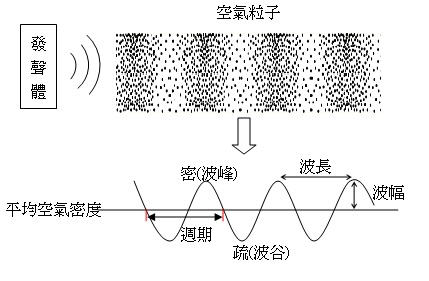

* **物理特性**：波长 (Wavelength)、周期 (Period)、相位 (Phase) 与相位抵消

  - 相位抵消：

    - **同相叠加**：如果波峰遇到了波峰，波谷遇到了波谷，它们会“合体”，声音会变大（变强）。
    - **相位抵消**：如果一个波的**波峰**，正好撞上了另一个波的**波谷**，一正一负，它们就会互相抵消（1 + (-1) = 0）。也是话筒指向性的原理

    解决方案：

    - 优化乐器和音箱的摆放：**音箱垫高并对准耳朵**
    - 声学改造

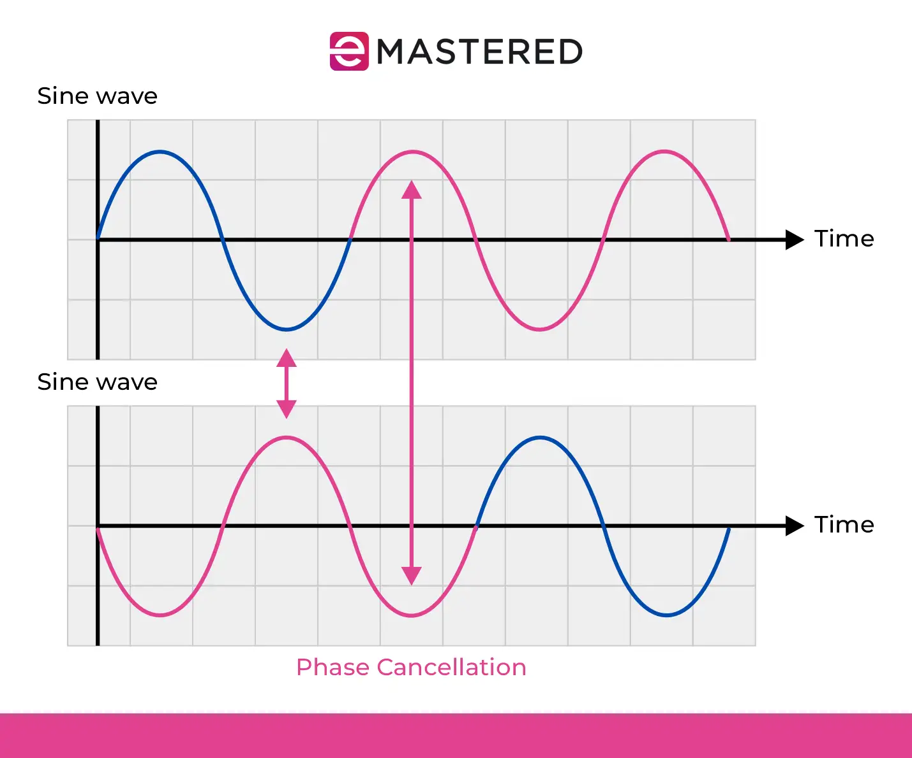

* **传播特性**：声速 (Speed of Sound, 20℃时约 343 m/s)、平方反比定律 (Inverse Square Law)：

  - 距离声源每增加一倍，声音大小固定减少 **6 dB SPL**。点声源（普通音响）

  - 所以需要补声或者使用音响阵列（让多个扬声器靠得足够近，它们发出的声波会相互耦合，将原本发散的声波“挤压”成**圆柱形波**向前推进。在这种模式下，距离每增加一倍，音量仅衰减 **3dB SPL**。这意味着**声音能传得更远，且全场前后排的音量差异大大缩小**）

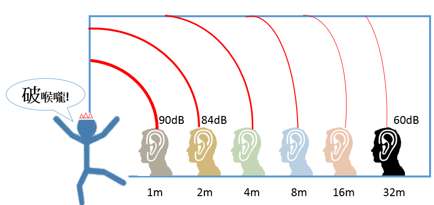

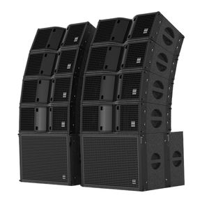

*   **环境声学现象**：反射 (Reflection)、吸收 (Absorption)、绕射/衍射 (Diffraction，如下图所示)、折射 (Refraction)

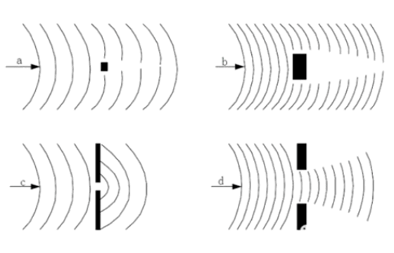

*   **声音的指向性：**声音的频率越高，指向性越强；频率越低，指向性越弱
*   **室内声学基础**：混响 (Reverberation)、回声 (Echo)、驻波 (Standing Waves)、房间共振 (Room Modes)

### 计量单位 dB

**常见单位 dB：**描述的是**两个量之间的倍数关系**，下方的 dB：**+6 dB**：代表**声压**增加一倍，但在人耳听觉上，要感觉声音响度刚好变大了一倍，需要声压变成原来的 **3.16 倍**，即 **+10 dB**。人耳能听到的最微弱声音，与能让人耳痛的巨大声音，其物理能量（声强）相差了 **1万亿倍 (`10121012`)**。如果用常规数值表示，生活中会充满几亿、几百亿这样的数字。用 dB 表示，这个范围被压缩到了 **0 dB 到 120 dB**，极其便于表达和计算。调音中常用于描述输出和输入的关系： 0dB 时，意味着对声音没有没有放大，也没有缩小，保持了原始输入的状态，+dB 则是放大，-dB 则是缩小

- **dB SPL（声压级）：许多情况下 dB 默认的单位**
  - 基准点（0 dB SPL）：人耳在 1kHz 频率下能听到的最小声音（`20μPa`）。
  - *应用：* 树叶沙沙声约 20 dB SPL，正常交谈约 60 dB SPL，摇滚演唱会约 110-120 dB SPL。
- **dBA（A计权分贝）：更懂人耳的噪音标准**
  - 人耳对低频（如低音炮）不敏感，对中高频（如人声、尖叫声）极其敏感。dBA 在测量时“过滤”掉了部分低频，其数值比纯声压级更真实地反映了**人耳觉得有多吵**。
  - *应用：* 现代敬拜（流行/摇滚风格），平均 85 - 95 dBA
- **dBFS（全满刻度）：数字音频的标尺**
  - 基准点（0 dBFS）：数字设备能记录的**最大信号极限**（爆音临界点）。
  - *应用：* 在电脑、手机或录音软件中，音量都是**负数**（如 -6 dB, -12 dB）。越接近 0 dB 声音越大，超过 0 dB 就会产生严重的数字失真（削波）。
- **dBm / dBV（电子学单位）：设备参数**
  - 以 1毫瓦（mW）或 1伏特（V）为基准，常用来衡量耳机放大器、Wi-Fi路由器天线的输出功率。

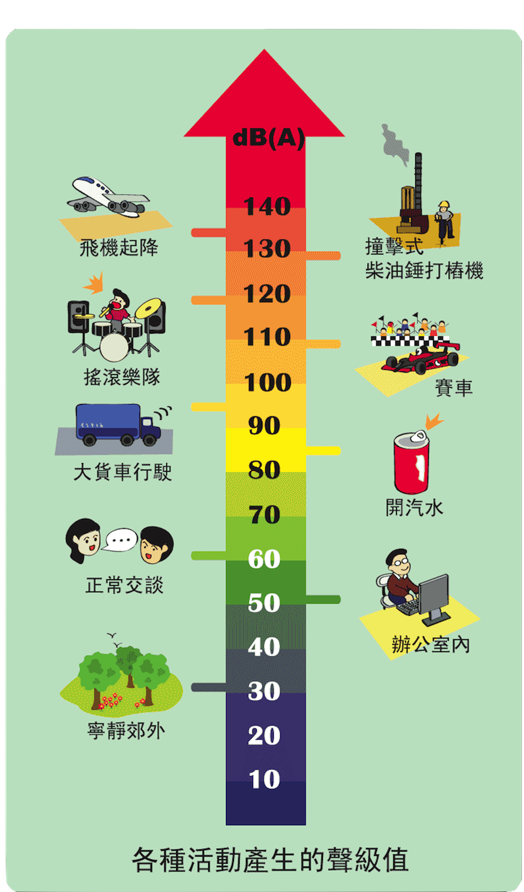

### 2. 心理声学基础 (Psychoacoustics)
* **人耳听觉范围**：20Hz - 20kHz，随年龄而衰退

  低中高音划分：
  
  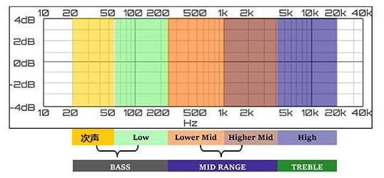
  
* **等响度曲线**：在不同频率下，人耳听起来响度感觉完全相同的一组声压级曲线，人耳对中频最敏感，对极低频和极高频相对迟钝

  - Fletcher-Munson Curves（弗莱彻-芒森曲线）

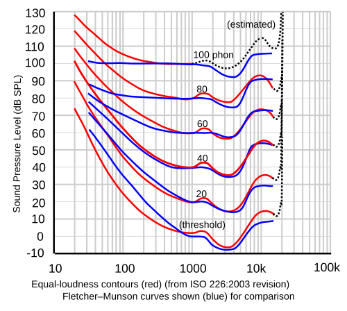

* **听觉效应**：

  - **哈斯效应 (Haas Effect / 优先效应)**：是一种双耳心理声学效应，声音延迟对人类方向听觉的影响要比音量大小的影响大得多的效应。故此，它也被称为**优先效应**。第一声音发出后25-35毫秒发出第二声音，听者则能听出为一整体融合的声音；但若相隔时间超过35毫秒，听者则听出为第二声源。听者也主要以第一声音确定声源的地点和方向。
  - **掩蔽效应 (Masking Effect)：**听觉系统对一种声音的感知被另一种声音所阻碍的现象，例如，在1kHz频率上发出的[声强](https://zh.wikipedia.org/wiki/声强)较大的声音，可能会将在1.1kHz频率上声强较小的声音掩盖（两个声音同时发生），或者两个声音极短时间内先后发生。对应的实际情况是 ”乐器打架“

  | 频段名称                             | 频率范围     | 声音特质与作用                                         | 主要乐器与关键频点                                           | 混音处理建议                                                 |
  | ------------------------------------ | :----------- | :----------------------------------------------------- | :----------------------------------------------------------- | :----------------------------------------------------------- |
  | **超低频 (Sub Bass)**             | 20Hz - 60Hz  | **音乐的基底**，提供深沉的震动感。                     | **底鼓 (Kick)** **贝斯 (Bass/808)**                       | 只允许最重要的低音乐器在此发声；其余乐器（人声、吉他等）必须使用**高通滤波器 (HPF)** 切除杂音。 |
  | **低频与中低频 (Low / Low-Mid)**  | 60Hz - 250Hz | 提供音乐的**温暖感**和**力量感**。                     | **底鼓击打点** (约 80Hz - 100Hz) **贝斯**琴弦泛音 **军鼓**“木质感” (约 200Hz) | 保持此频段的饱满度，但要注意避免多种乐器堆积导致声音浑浊。   |
  | **中频与中高频 (Mid / High-Mid)** | 250Hz - 4kHz | **人耳最敏感的频段**，是主唱和主要旋律乐器的核心阵地。 | **主唱**与主要旋律乐器 **军鼓**“啪”声 (约 3kHz - 5kHz) **吉他**咬合力 | 为了突出人声，应在此频段对伴奏乐器做微小的衰减（**掩蔽效应处理/让频**）。 |
  | **高频与极高频 (High / Air)**     | 4kHz - 20kHz | 提供**空气感、亮度、清晰度**以及整体氛围的烘托。       | **人声**齿音 (约 6kHz - 8kHz) **吉他/镲片**闪耀感 (10kHz 以上) | 适当提升可增加华丽感，但需注意通过 EQ 或 De-esser（消除齿音效果器）**控制人声齿音**，避免刺耳。 |

  - **双耳定位 (Binaural Localization)：**基于双耳时间差 (Interaural Time Difference, 简称 ITD，主要用于定位**低频声音**)，双耳强度差/声级差 (Interaural Level Difference, 简称 ILD，主要用于定位**高频声音**)，耳廓效应与头相关传递函数（判定声源在前方，上方，后方，很复杂：虚拟环绕声技术（如空间音频），如果耳廓（外耳）完全消失（或者被填平），人类会**立刻丧失绝大部分判断声音高度（上下）和前后方向的能力**），脑补（生活经验判断，比如说飞机声：天上）

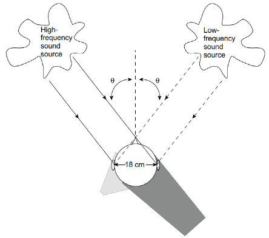

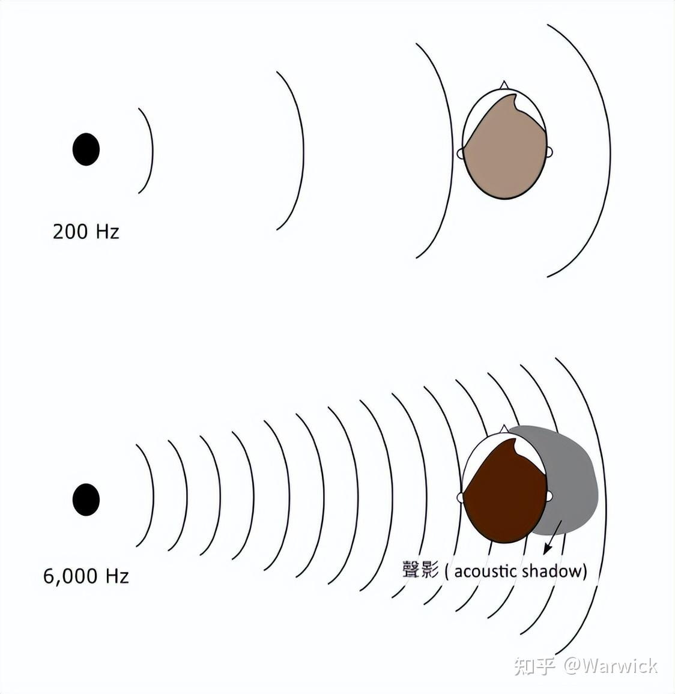

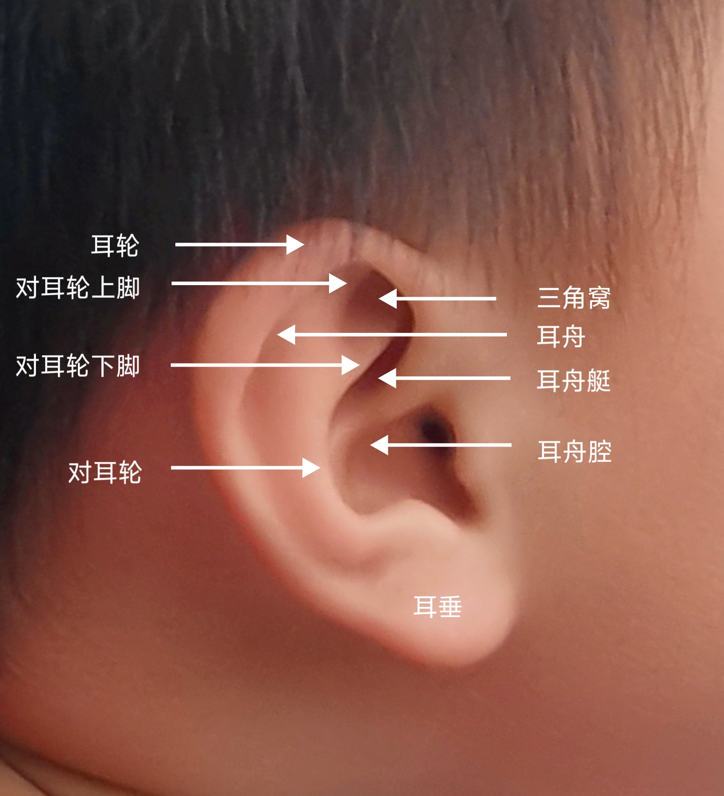

### 3. 数字音频基础 (Digital Audio)

数字信号与模拟信号：

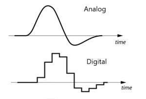

* **模数/数模转换**：ADC (Analog to Digital) 与 DAC (Digital to Analog)

* **DSP （Digital Signal Processor）：**高端声卡会内部集成 DSP，从而低延迟加载效果器等。集成 ADC + 数字信号处理（狭义 DSP） + DAC，常见有小尾巴。

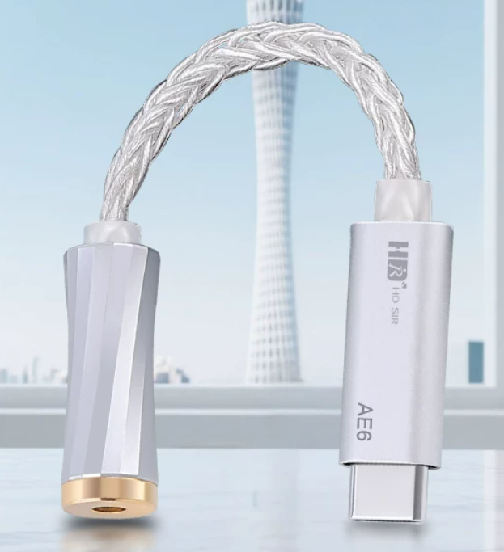

* **采样率 (Sample Rate)**：奈奎斯特定理 (Nyquist Theorem)、常见标准 (44.1k, 48k, 96k, 192k)。相对于视频普通的 60FPS，音频采样频率很高，但是更高频率主要是为了减少失真。
  - 奈奎斯特定理 (Nyquist Theorem)：为了确保能够完美还原连续的模拟信号，采样频率必须至少是被测信号最高频率分量的 **两倍**，即音乐采样频率要为人耳两倍

* **位深度 (Bit Depth)**：动态范围 (Dynamic Range)、量化噪声与抖动 (Dither)、常见标准 (16-bit, 24-bit, 32-bit float)

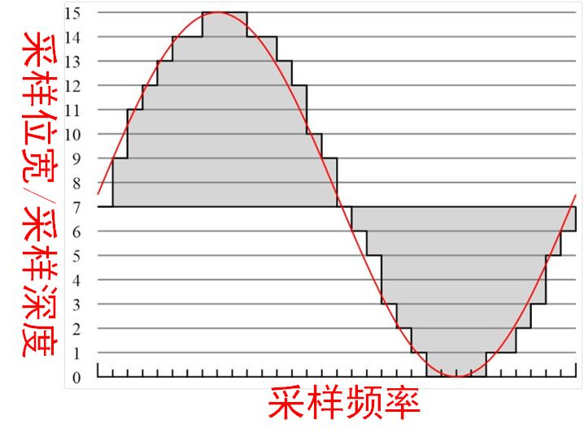

* **系统参数**：缓冲大小 (Buffer Size) 与 延迟 (Latency)

* **音频文件格式**：无损 (WAV, AIFF, FLAC) 与 有损 (MP3, AAC)

* **音质：**共同取决于 音源，解码与放大，发声单元，声学环境

---

## 二、 信号电平、常见接口与音频线材 (Signals, Interfaces & Cables)
### 1. 音频信号分类与电平 (Audio Signal Levels)
*   **麦克风电平 (Mic Level)**：毫伏级（最弱信号，需话放）
*   **乐器电平 (Instrument Level)**：高阻抗信号 (Hi-Z)
*   **线路电平 (Line Level)**：专业级 (+4 dBu) 与 消费级 (-10 dBV)，常用 DI 盒转换
*   **扬声器电平 (Speaker Level)**：大电流 / 高电压（需功放驱动）

### 2. 传输原理：平衡与非平衡 (Transmission Principles)
*   **非平衡信号 (Unbalanced)**：单芯屏蔽 (Tip-Sleeve)，易受电磁干扰 (EMI/RFI)，适合短距离

*   **平衡信号 (Balanced)**：双芯屏蔽 (Tip-Ring-Sleeve / Hot-Cold-Ground)，共模抑制比 (CMRR) 消除底噪，适合长距离

### 3. 常见模拟接口与线材 (Analog Connectors)

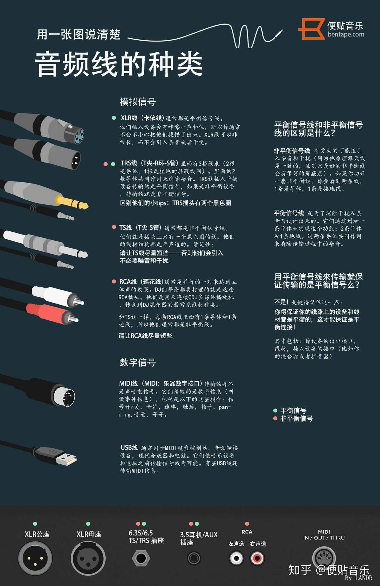

0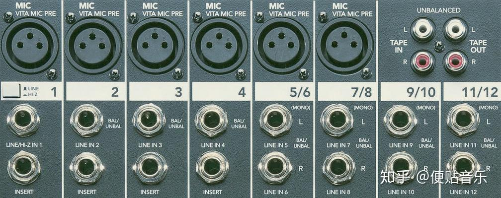

*   **XLR (卡侬头)**：最常见的平衡接口（公头/母头定义，Pin 1地，Pin 2热，Pin 3冷）

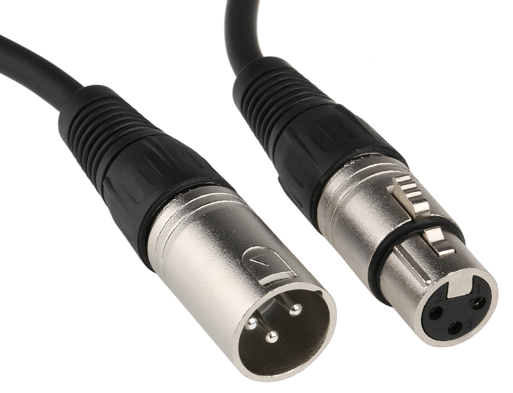

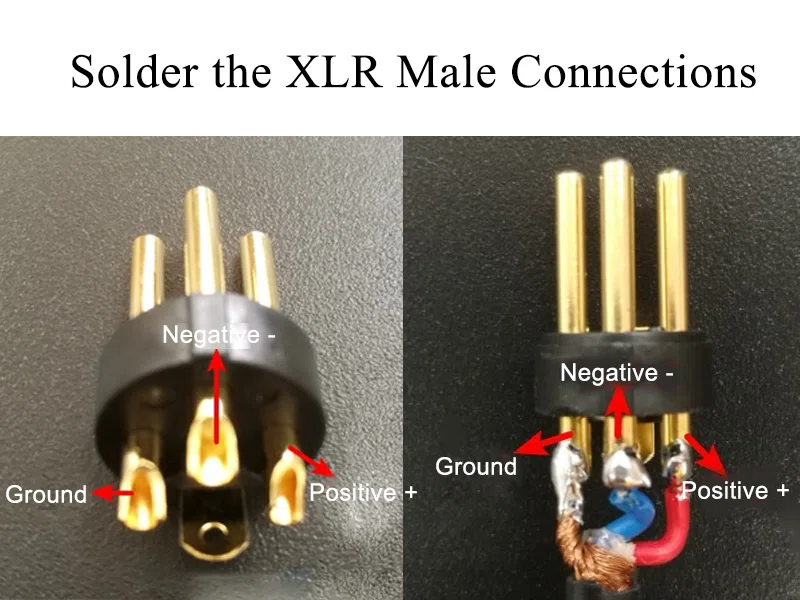

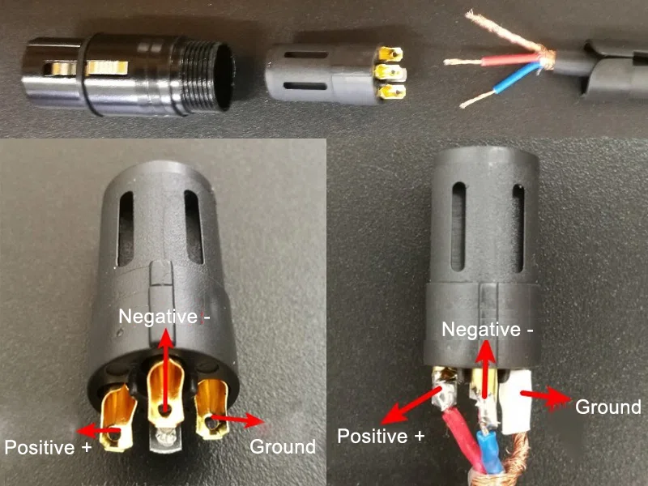

*   **1/4" (6.35mm) 插头**：大三芯 TRS（平衡/立体声）与 大二芯 TS（非平衡/单声道/吉他线）

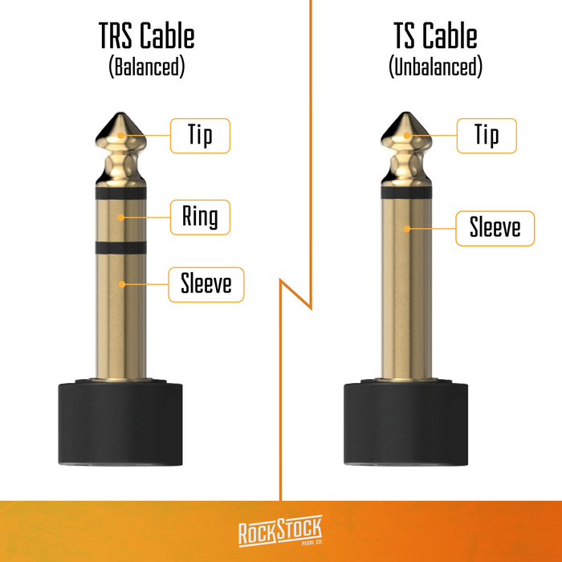

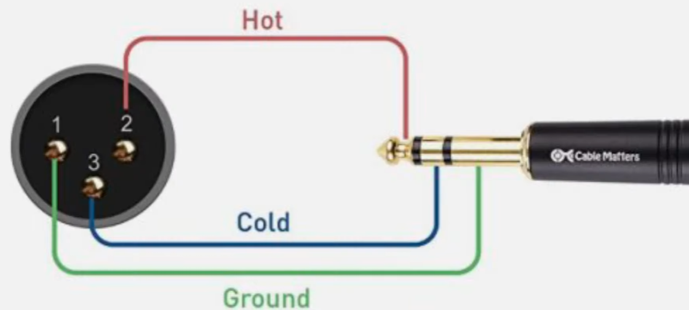

  - XLR combo 接口：

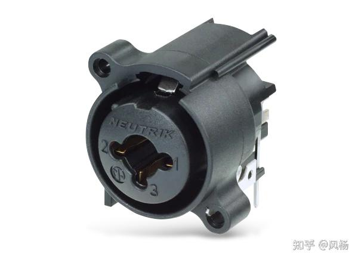

*   **1/8" (3.5mm) 插头**：小三芯，常见消费级耳机/AUX接口（TRS/TRRS）

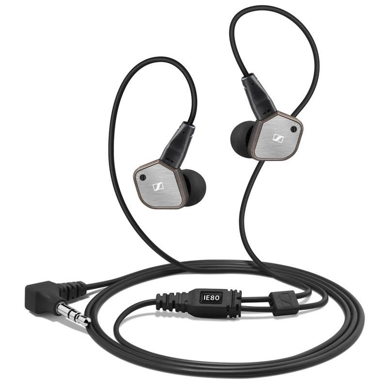

*   **RCA (莲花头)**：常见于DJ设备、家庭影院（非平衡）

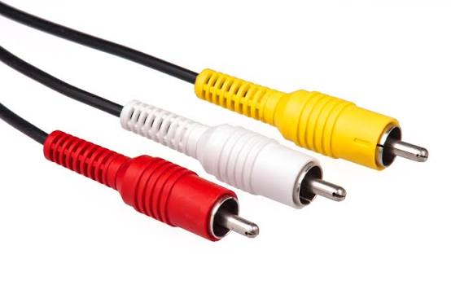

### 4. 常见数字与网络音频接口 (Digital & Network Protocols)
*   **传统数字接口**：**MIDI (5-pin DIN)**, S/PDIF (同轴/光纤), AES/EBU, ADAT (光纤)

MIDI 协议：

*   **网络数字协议 (AoIP)**：**Dante**, AVB, MADI, SoundGrid (系统拓扑扩展)

---

## 三、 音频输入认知 (Core Audio Equipment Recognition)
### 1. 拾音设备：麦克风 (Microphones)
*   **工作原理分类**：
    *   动圈麦克风 (Dynamic)：耐高声压级(SPL)，无需供电（如 Shure SM58/SM57）
    *   电容麦克风 (Condenser)：灵敏度高，频响宽，需 48V 幻象电源 (Phantom Power)
    *   铝带麦克风 (Ribbon)：脆弱，音色温暖复古

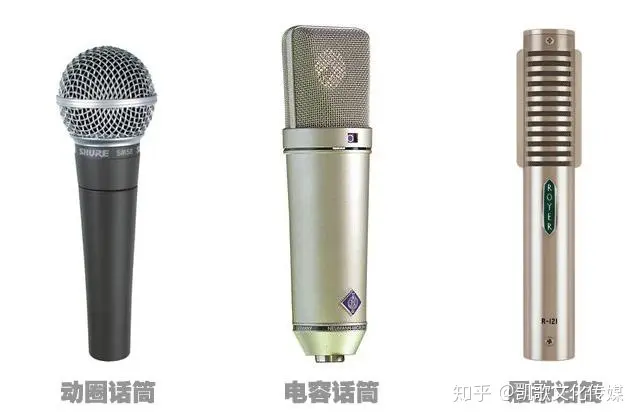

*   **指向性 (Polar Patterns)**：全指向 (Omnidirectional)、心形 (Cardioid)、超心形 (Supercardioid)、8字型 (Figure-8/Bidirectional)

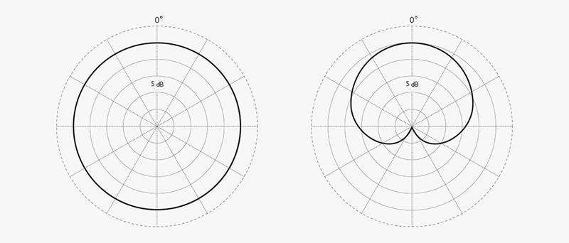

*   **近讲效应 (Proximity Effect)：**当声源（如人的嘴巴或乐器）越靠近麦克风，麦克风收到的低频（低音）就越多，收音会更加深沉，但是注意不要喷麦
*   **话筒使用：**握住话筒手柄的下半部（约 1/4 处），保持话筒与嘴巴距离约 **两指宽到一拳**，并与嘴唇呈 **45度角** 倾斜指向口唇中心

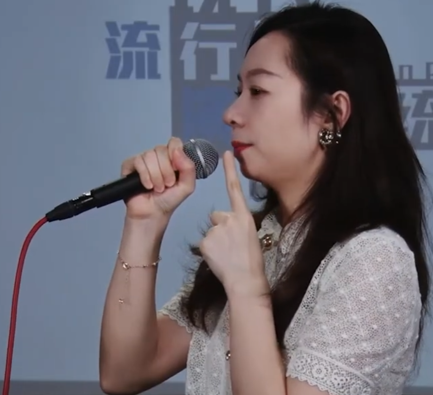

### 2. 乐器设备 (Instruments)

**常用乐器：**

- 节奏与根基，律动

  - **架子鼓（全频段（偏极低与极高））：**节奏

    video:

    - [架子鼓 NUMB 林肯公园](https://www.bilibili.com/video/BV1EE411Y78p?vd_source=34e7d6e2081c3f2ce5f5123116b3beaf)

  - **贝斯（低频）：**连接节奏与旋律的桥梁

    video：

    - [「贝斯谱」海龟先生 - 男孩别哭](https://www.bilibili.com/video/BV18BRNBPEPp?vd_source=34e7d6e2081c3f2ce5f5123116b3beaf)

    - [这个杀手不太冷 Bass SOLO](https://www.bilibili.com/video/BV1qW411x7sg/?spm_id_from=333.337.search-card.all.click&vd_source=9d1707582d7de441b28987bcf29b8464)

-  旋律与和声

  - **吉他（中高频）：**电吉他 / 木吉他

    - 主音吉他：负责前奏、间奏、尾奏以及炫酷的吉他独奏（Solo）和穿插乐句（Licks），音色尖锐、极具穿透力和歌唱性
    - 节奏吉他：主要负责刷奏和弦、分解和弦，为歌曲提供紧凑的伴奏支持

    video：

    - 电吉他：[张逸帆 摇滚卡农](https://www.bilibili.com/video/BV16x41167Rn?vd_source=34e7d6e2081c3f2ce5f5123116b3beaf)
    - 木吉他: [未闻花名ED secret base~](https://www.bilibili.com/video/BV1gs411m7XZ?vd_source=34e7d6e2081c3f2ce5f5123116b3beaf)

  - **键盘与合成器（全频段（偏中音））： **极具极强的声学兼容性。键盘手不仅可以弹奏原声钢琴、电钢（Rhodes）、复古风琴（Organ）的音色，更可以通过合成器（Synth）发出管弦乐弦乐铺底（Pad）、电子跳动主音（Lead）以及各种奇特的空间氛围音效

    video：

    - 钢琴音色：[熙熙攘攘我们的城市](https://www.bilibili.com/video/BV1ZD421n7aV?vd_source=34e7d6e2081c3f2ce5f5123116b3beaf)
    - Pad 音色：[推荐6款Pad音色](https://www.bilibili.com/video/BV1WM4m1y7b2?vd_source=34e7d6e2081c3f2ce5f5123116b3beaf)

**DI 盒(Direct Injection Box)：**作用（高阻转低阻，非平衡转平衡），无源 (Passive) 与有源 (Active) 的选择

- 无源 DI 使用场景：设备是**自己带电的（有源设备）**。如键盘，电鼓，效果器输出

* 有源 DI 使用场景（需要 48V 供电）：**纯物理被动的（无源设备）**，它们的信号极其微弱，且非常脆弱，极易受到“负载”的影响而丢失音色。如吉他，贝斯

**乐器效果器**

- 乐手处理完再发给调音台

**无线音频设备使用基础 (Wireless Systems)：**

*   发射机 (Transmitter - 麦克风/腰包) + 接收机 (Receiver)，频率选择

### 3. 控制中枢：调音台 (Mixing Consoles)
*   **架构认知**：模拟调音台 (Analog) vs. 数字调音台 (Digital)

模拟调音台：

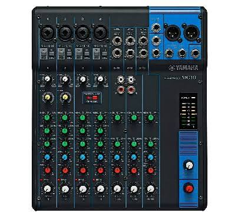

模拟调音台：

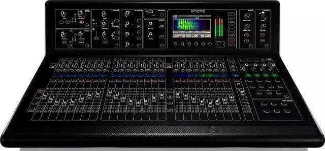

*   **通道条 (Channel Strip) 基础**：Gain(增益/话放), HPF/LPF(高低通滤波), EQ(均衡), Aux/Send(辅助发送), Pan(声像), Fader(推子), Mute/Solo
*   **母线与路由 (Buses & Routing)**：Main Mix(主输出), Subgroups(编组), VCA/DCA, Matrix(矩阵)

### 4. 驱动与发声：功放与音响系统 (Amplifiers & Speakers)
*   **功放 (Power Amplifiers)**：阻抗匹配 (Impedance/Ohms)，功率余量 (Headroom)，持续功率(RMS) vs. 峰值功率(Peak)，阻尼系数

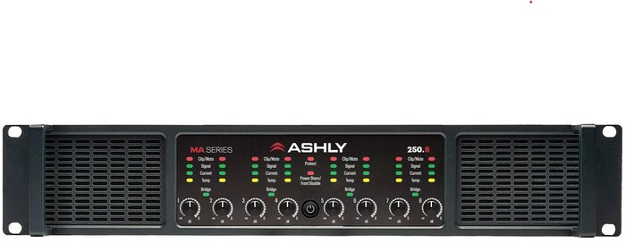

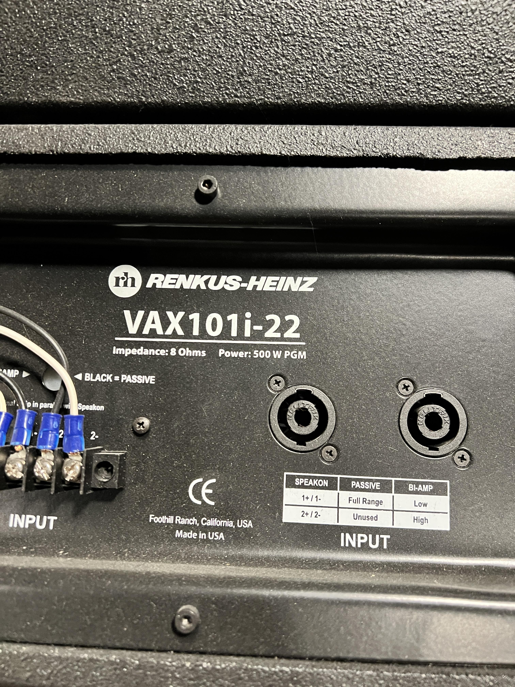

* **扬声器 (Speakers)**：
  *   有源音箱 (Active) vs. 无源音箱 (Passive)
  *   频段划分：超低音 (Subwoofer)、低音 (Woofer)、中音 (Mid-range)、高音 (Tweeter)
  *   分频器 (Crossover)：主动分频与被动分频

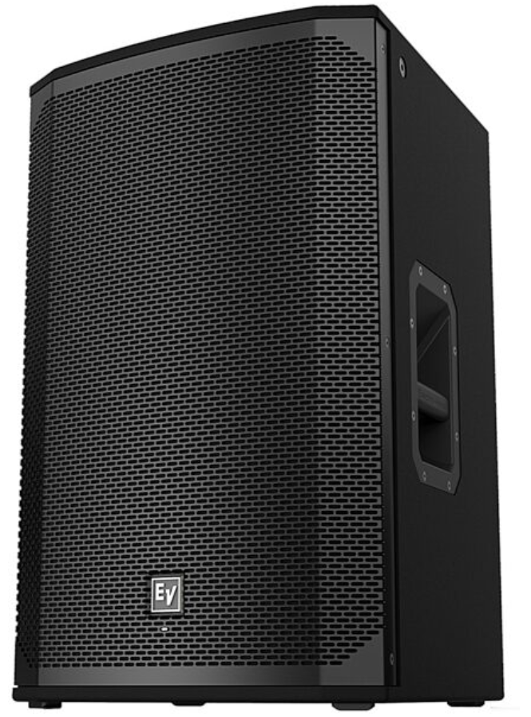

* **连接线材（speakON）：**

* **处理器：**调音台输出到功放之间的设备，控制延迟，EQ等

---

## 四、 连接、无线电、系统拓扑与效果器链 (System Flow & Topology)
### 1. 信号流与增益架构 (Signal Flow & Gain Staging)
*   **标准信号流**：音源 (Source) -> 麦克风/DI -> 线缆 -> 话放 （调音台内置） -> 调音台处理 -> 功放 (Amp) -> 扬声器 (Speaker) -> 人耳

### 3. 现场系统拓扑基础 (System Topology)
*   **主扩系统 (FOH - Front of House)**
*   **舞台返听系统 (Stage Monitoring)**：地台音箱 (Wedges) 与 耳返 (IEM)
*   **接口箱 (Stage Box) 与 信号分配 (Splitters)**

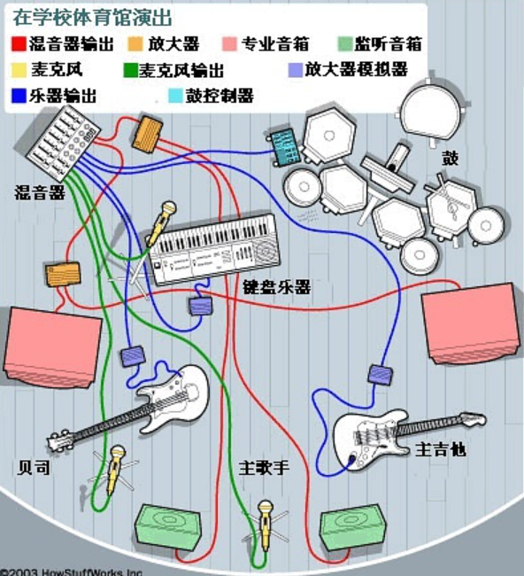

---

## 五、 课后作业 (Homework)

### 声压测量

- 使用分贝仪测量现场合适的声压对应的调音台输出电平

### 线材焊接实操 (Cable Soldering Practice)
*   **任务：制作非平衡线**：制作一条 3米 1/4" TS 吉他乐器线。

### 系统拓扑图绘制 (System Topology Drawing)
*   **任务描述**：假设你需要为一个小型现场乐队（编制：主唱x1、电吉他x1、木吉他x1、电贝斯x1、键盘x1）搭建系统。请绘图画出从**音源拾取**到**调音台**，再到**扩声/返听音箱**的完整系统连线拓扑图。
*   **考核点（图面必须包含）**：
    1.  正确的设备选用（主唱选什么麦？吉他/键盘是否需要DI盒？用什么线材连接？）
    2.  连线类型标注（用不同颜色或线条标明 XLR平衡线、TS非平衡线、Speakon喇叭线）。
    3.  调音台的信号分配（Main LR 接主扩功放/音箱，Aux 发送接舞台返听音箱）。
    4.  标注 48V 幻象电源的开启位置（如有需要）。
