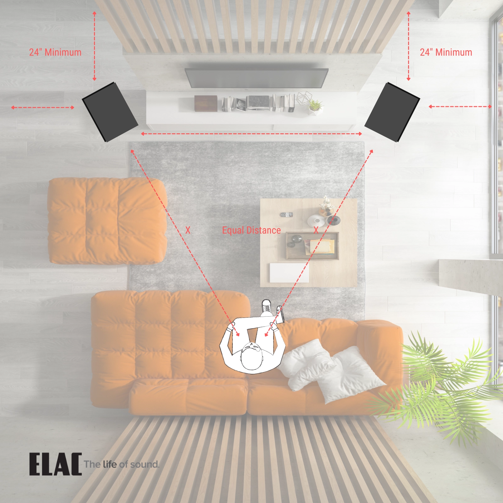
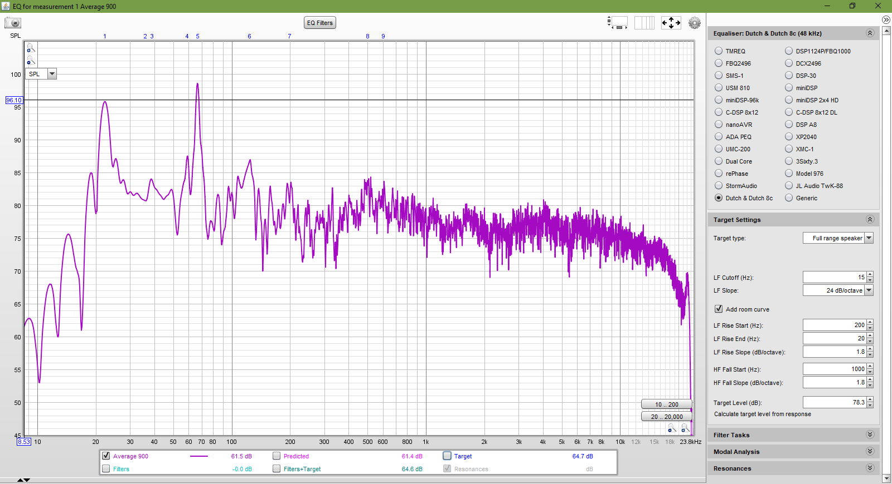
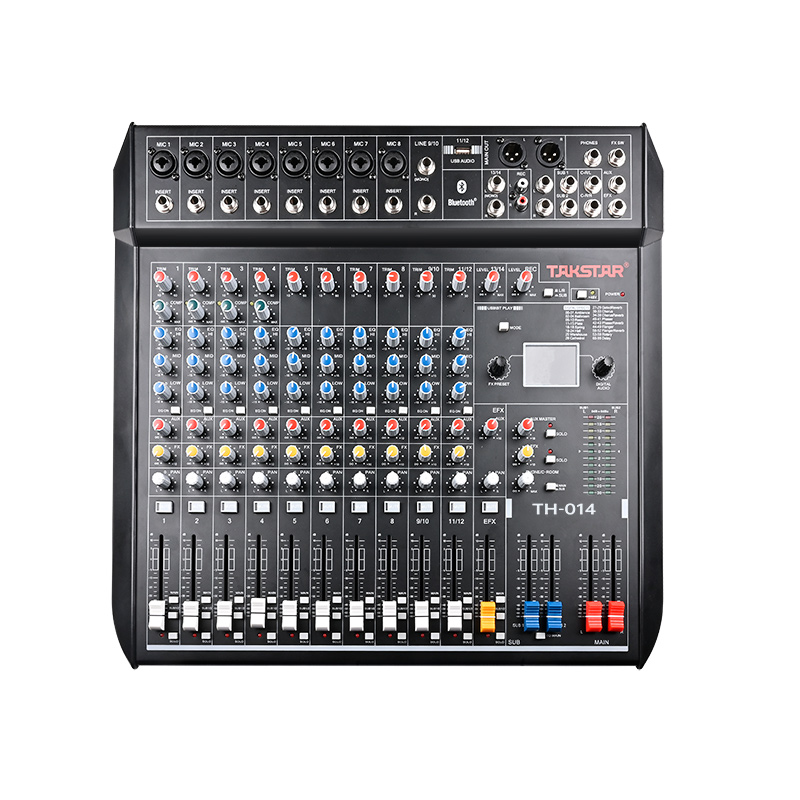
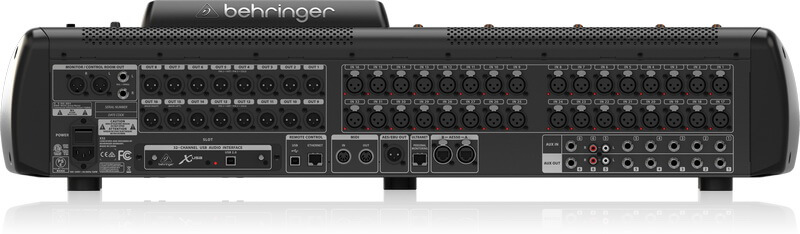
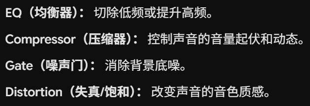
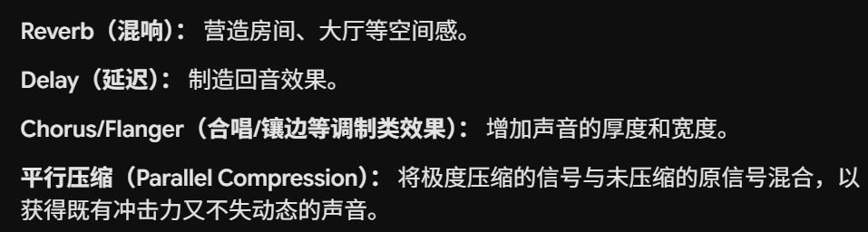
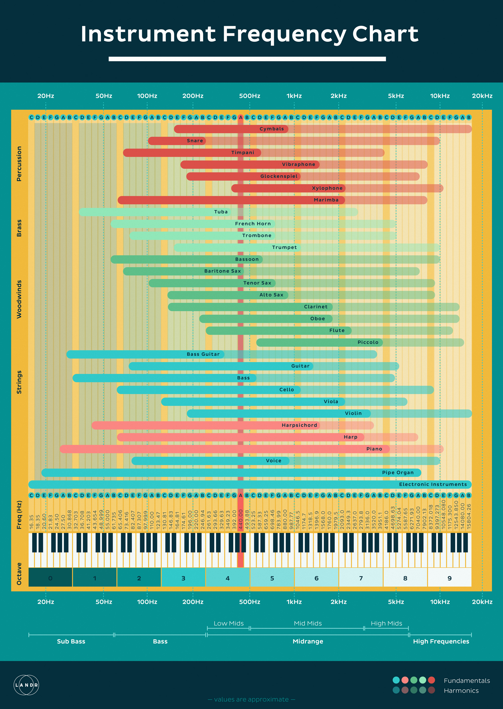
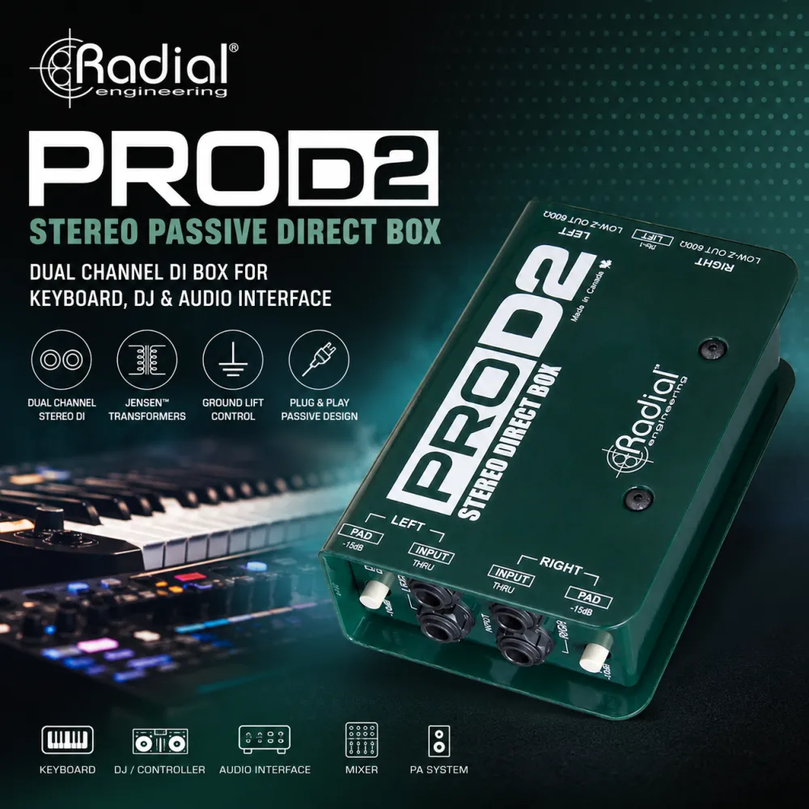
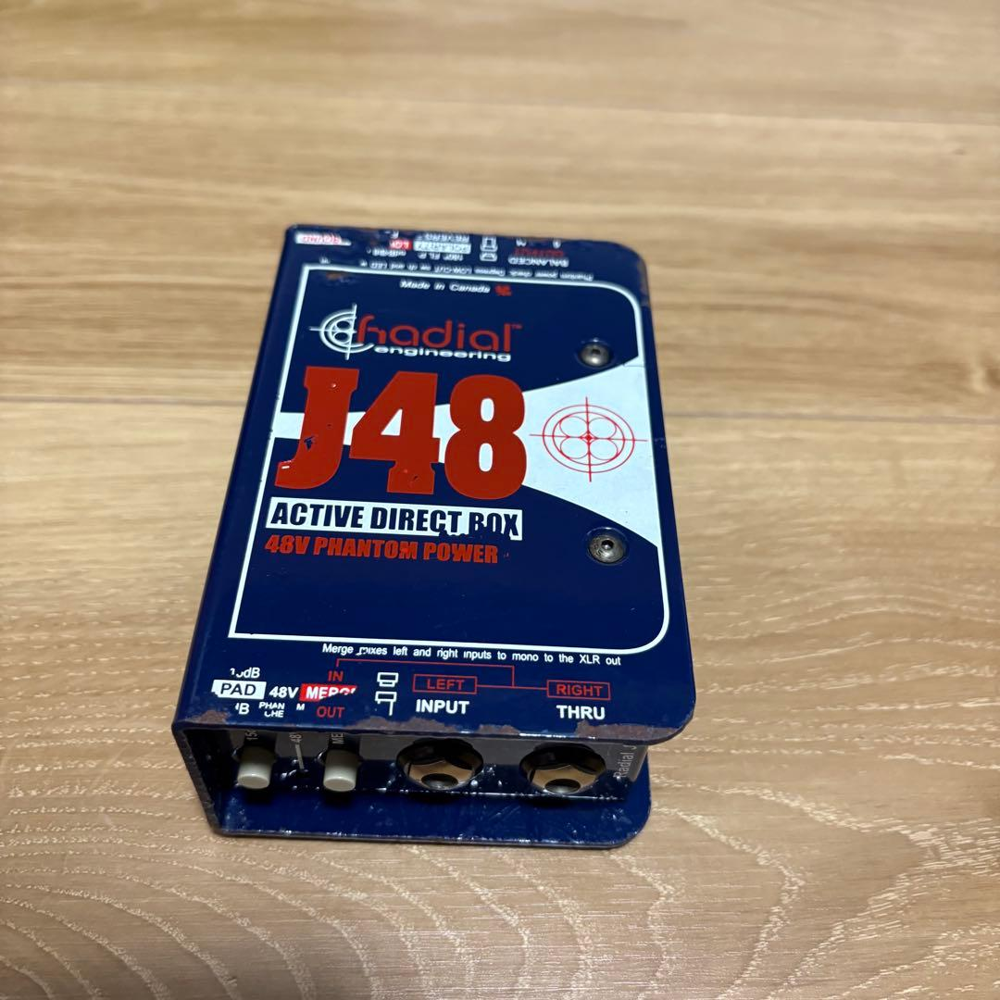

# 调音（现场扩音）

### 音响混音

*   **主扩混音（FOH - Front of House）**：为观众服务
    *   Live 混音与 Studio 混音的区别（瞬态、动态与声学环境妥协）：妥协的艺术，现场环境通常声学条件极差，还有串音等问题
    *   Soundcheck（走台/试音）的标准流程（Line Check, 增益设定, 乐器平衡）
*   **监听混音（Monitor Mixing）**：为乐手，歌手服务
    *   舞台返听音箱（Wedges）的位置与极性（针对麦克风指向性）
    *   入耳式监听（IEM）混音技巧与双耳声像处理
    *   Pre-Fader（推子前）发送的原则
*   **数字音频网络**
    *   音频网络协议认知（**Dante**, AES50, MADI, AVB）

### 现场扩音与系统调试（Live Sound & Tuning）

*   **扩音系统（PA）设计基础**
    
    * 扬声器类型（点声源 Point Source vs. 线阵列 Line Array）
    
    * 补声系统设计（Front Fill, Out Fill, Delay Line/延时塔）
    
    * 音响摆放：
    
      家庭音响（2.0 / 2.1 立体声系统）：
    
      - **等边三角形法则**：两只音箱与你的头部（皇帝位）应该构成一个等边三角形。也就是说，两只音箱之间的距离，应大致等于音箱到你人耳的距离。
    
      - **高音单元与人耳齐平**：高音具有很强的指向性。当你坐在椅子或沙发上时，音箱的高音单元（通常是上面的小喇叭）最好能与你的耳朵在同一水平线上。如果放得太低，可以使用倾斜的音箱垫将其略微上仰。
    
      - **内倾角（Toe-in）**：不要让两只音箱完全平行直视前方，而是将它们略微向内旋转，让声音直指你的双耳。这能让中间的人声（结像）更加扎实。
    
      - **拉开与墙壁的距离**：大多数音箱（特别是后置倒相孔的音箱）如果紧贴墙壁，会导致低频浑浊轰头。尽量让音箱背面**距离墙壁至少 30-50 厘米**，且绝对要**避开墙角**（墙角会严重放大低频驻波）。如果是2.1系统，低音炮（Subwoofer）可以放在前方两侧，但同样避免死角。
    
      
    
      PA扩声系统：
    
      - 主扩音响：
        - 必须放在所有麦克风的前方（靠近观众的那一侧）
        - **高音单元必须高于前排观众的头部（通常离地 2 米 - 2.5 米左右）**，并微微向下倾斜（约 5°- 10°）。**不要平行摆放**，稍微将它们向内旋转（Toe-in），使其声音的中心轴线在观众区中后方交叉
        - 超低音（Subwoofer）推荐放到舞台正中央地面
      - 监听音响：尽量对准耳朵，并且台上听得清就行，不要拼音量
        - 歌手返听音响：基于麦克风指向性，摆放于麦克风收音较弱的位置。乐手实在听不见就只能上耳返了
        - 乐手音响（乐器音响 / 返听音响）：对准耳朵，控制音量

* **现场系统调试（System Tuning）**

  - 噪声：测量声学环境

    - **白噪音（White Noise）**：每赫兹（Hz）功率相等，高频更“刺耳”。频谱平坦

    - 粉红噪音（Pink Noise）：每倍频程（Octave）功率相等，低频能量更高，听起来更“温暖”，常用于房间声学均衡。

  *   测量麦克风与声学测试软件操作（SMAART, SysTune 或 REW 基础）
  *   传递函数（Transfer Function）与粉红噪声（Pink Noise）
  *   RTA（实时频谱分析）与相位曲线分析
  *   系统对齐（Alignment）：主扩与超低的时间/相位对齐（Delay Alignment）
  * 系统均衡（System EQ）：校正房间频率响应缺陷

    

* **无线电（RF）与无线系统管理**

  *   无线话筒与IEM（耳返）系统架构

* **反馈抑制（防啸叫技术）**

  *   啸叫（Acoustic Feedback）产生的物理闭环原理
  *   啸叫点的寻找与抑制（Ringing out the room / 扫频法）

## 调音台教程

数字调音台 & 模拟调音台

#### 第一部分：初识数字调音台与 X32 硬件

- **控制面板分区巡礼：** 通道推子区、总控区、屏幕与快捷键区、通道条处理区（Channel Strip）

- **背板接口解析：** 本地输入/输出（XLR）、AES50 接口（连接数字接口箱/Stagebox）、USB 接口、网络与扩展卡

  

- **屏幕导航基础：** 页面切换按键（Page Select）与屏幕下方六个多功能旋钮的配合使用

#### 第二部分：输入与路由（让声音进来）

- **初始化调音台：** 如何将台子恢复到安全的出厂默认状态（Initialize Console）
- **理解 Routing（跳线）菜单：** Input 页面解析
- **Patching（跳线分配）：** 如何打破常规，将输入接口 1 分配到控制通道 15

#### 第三部分：通道条处理（塑造声音）

- **配置 (Config) 与前置放大器 (Preamp)：** 增益（Gain）的设置、48V 幻象电源、低切滤波器（Low Cut）、极性反转（Phase/Polarity）
- **动态控制 1：** 噪声门（Gate）与闪避效果（Ducking）的基础设置
- **均衡器 (EQ)：** 四段全参数均衡的使用、RTA（实时频谱分析）界面的开启与读图
- **动态控制 2：** 压缩器（Compressor）的阈值、比例、起音与释放时间详解
- **通道关联 (Link)：** 如何将两个相邻通道链接为立体声（Stereo Link）

#### 第四部分：混音与输出（把声音送出去）

- **主输出混音 (Main LR)：** 推子操作、声像（Pan）调节
- **什么是 Bus：** 调音台的“快递分拣中心”
- **返听混音 (Monitor Mixing)：** 使用 Pre-fader Bus 给乐手送返听
- **输出跳线 (Analog Out)：** 如何将混好的 Bus 或 Main LR 信号指派到背板的物理 XLR 输出口

#### 第五部分：效果器、DCA与高级控制

- **效果器机架 (FX Rack)：** Insert（插入）与 Send/Return（发送/返回）效果的区别

  Insert（插入）：串联处理

  

  Send/Return（发送/返回）：并联处理

  

- **混响与延时：** 如何使用 Post-fader Bus 给主唱添加混响

- **DCA 编组：** 将所有鼓组或所有伴唱分配到一个推子控制

- **静音编组 (Mute Groups)：** 一键静音所有乐队通道或效果器通道

- **矩阵 (Matrix)：** 用来干什么？（例如：送给补声喇叭、直播推流、录音机）

#### 第六部分：自动化与系统管理

- **场景记忆 (Scenes & Snippets)：** 如何保存、加载演出配置，以及“安全锁定”（Safe）特定通道不被覆盖。
- **对讲系统 (Talkback)：** 设置对讲麦克风并路由给乐手返听。
- **录音与播放：** 使用面板上的 USB 接口进行立体声录音/播放，以及使用背板扩展卡进行 32 轨多轨录音（连接 DAW）。
- **远程控制：** 配置路由器，使用 iPad (X32-Mix) 或电脑 (X32-Edit) 软件进行无线调音。

## 软件使用 X32 / X18 air

ios，android，windows

录音软件 cubase

### 乐器特性与 EQ 雕刻

网站推荐：https://danmurtagh.com/eq-frequency-chart

* **底鼓（Kick）：** “砰砰”声。EQ 重点：切除 200-300Hz 的纸板/浑浊音；提升 50-80Hz 增加低频厚度；提升 3k-5kHz 增加鼓槌击打的清晰“吧嗒”声

* **贝斯（Bass）：** 音乐的地基。提升 100-200Hz 增加肉感
  - **关键技巧：** 贝斯和底鼓会抢低频，需要错开（比如底鼓凸显60Hz，贝斯就凸显120Hz）
  
* **木吉他（Acoustic Guitar）：** 

  - 开启 HPF（高通滤波）切除 100Hz 以下，因为吉他不需要那么低的频段，会跟贝斯打架

  - 切掉 800Hz 左右的“闷罐声”，稍微提升 8kHz 以上的“空气感/弦丝声”

* **键盘（Keys / Pad）：** 

  - 声音很宽，容易掩蔽人声。在混音中要拉宽声像（Pan，一左一右）
  - 并在 2k-4kHz 人声主要的频段给键盘做稍微的衰减（EQ 让路）

* **人声（Vocals - 最核心）：**

  * **HPF（高通滤波）：** 所有人声必须开启，切除 100Hz-120Hz 以下，消除喷麦声、舞台脚步声
  * **去浑浊：** 衰减 300-400Hz 左右的鼻音/嗡嗡声
  * **增加清晰度：** 提升 3k-5kHz 让咬字清晰（Presence）
  * **控制齿音：** 如果“刺、呲”声太大，要在 6k-8kHz 做窄带衰减，或使用 De-esser（齿音消除器）

### 调音台的工作流（以 X32 架构为例）

信号在 X32 内部是如何走完整个流程的：

1.  **模拟输入层 (Analog Input)**：
    声乐/乐器信号 -> XLR接口 -> MIDAS 模拟话放 -> 进行阻抗桥接并进行前置放大（Gain）
2.  **模数转换层 (ADC - Analog to Digital Converter)**：
    *   经过话放放大的模拟波形，立刻进入 ADC 芯片
    *   X32 采用 **24-bit / 48kHz** 的采样标准。这意味着它每秒对音频波形拍照 48,000 次，并以 1,677 万个精度等级（24-bit）将其转换为 0 和 1 的数字代码
    *   **极其关键的一点**：一旦越过 ADC，信号就不再受到模拟电路的底噪、串音干扰了
3.  **数字处理层 (DSP - Digital Signal Processing)**：
    转化为数字信号后，进入 X32 内部的 40-bit 浮点运算 DSP 芯片。接下来你操作的
    *   **极性翻转 (Polarity)、低切 (Lo-Cut/HPF)**
    *   **门限 (Noise Gate)、动态压缩 (Compressor)**
    *   **四段全参数均衡 (Parametric EQ)**
    *   **插入效果器 (FX Insert，如混响/延时)**
    *   **路由发送 (Bus/Aux Send) 和 DCA 编组**
4.  **数模转换与输出层 (DAC & Output)**：
    最后，混合好的 0 和 1 数字信号被送入 DAC（数模转换器），重新变成模拟电压波形，通过 XLR 主输出接口（Main Out）采用**平衡传输**发送给功放或有源音箱

### 实际一个信号路径：

**输入与放大 (Input & Gain)：** 声音进入通道，通过话放调节基础增益

**插入效果 (Inserts)：**  EQ 和压缩等，所在的位置。** 它们是**串联**在主水管上的滤水器。水流必须经过它们，且水质（音色/动态）会在这里被彻底改变

**推子前发送 (Pre-Fader Sends)：** 截取点 A。从这里分流出去的水，已经经过了 EQ 和压缩的处理，但不受下方主水龙头（主推子）控制。主要有 监听，录音

**主推子 (Main Fader)：** 控制这个通道送到主输出（总线）的音量

**推子后发送 (Post-Fader Sends)：** 截取点 B。从这里分流出去的水，既经过了 EQ/压缩，也受到了主推子音量大小的控制。主要有 空间类效果器，编组控制

**声像 (Pan) -> 主输出 (Master)：** 决定声音在左右声道的位置，最终流向总输出

## 话放 & 阻抗桥接 & DI

#### 1. 话筒放大器（Mic Preamp / 话放）

*   **原理**：麦克风咪头产生的电信号极其微弱，属于**Mic Level（毫伏级别，约 0.001V - 0.01V）**。而调音台内部处理和输出需要标准的工作电压，即**Line Level（线路电平，约 1.228V）**。话放的作用就是将这个微弱信号放大几十倍甚至上千倍（提供几十 dB 的 Gain / 增益）
*   **在 X32 中的体现**：X32 最引以为傲的就是搭载了 **MIDAS 设计的可编程话放**
    *   **高动态与低底噪**：即使将增益拧得很大，它引入的电路底噪依然极低
    *   **数字控制模拟**：在传统的模拟台上，Gain 是个纯物理电位器；在 X32 上，你在屏幕或旋钮上调的 Gain，实际上是通过数字芯片控制底层的模拟电阻网络。这使得 X32 的增益设置可以被**保存和一键调用（Scene Recall）**

#### 2. 阻抗桥接（Impedance Bridging）

很多人听过“阻抗匹配”（Impedance Matching），但在现代调音台输入端，我们使用的其实是**“阻抗桥接”**

*   **什么是阻抗？** 简单理解，它是交流电路中对电流的阻力
*   **为什么不用阻抗匹配？** 阻抗匹配（输入阻抗 = 输出阻抗）用于最大化**功率传输**（比如功放推音箱）。但在话筒到调音台的环节，我们不在乎功率，我们只想要**最高效的“电压传输”**（因为音频信号的波形就是电压的起伏）
*   **阻抗桥接原则**：**“低阻输出，高阻输入”**。为了让电压无损耗地传递给调音台，调音台的输入阻抗必须**远大于**话筒的输出阻抗（通常要求至少大 10 倍）

#### 3. DI 盒

主要是为了：1. 将信号装成平衡信号，2. 阻抗桥接

具体使用 “异性相吸“：一般推荐的是 **无源和有源搭配**：

- **有源输出** 搭配 **无源 DI 盒**：如键盘，电鼓，吉他效果器

  

- **无源输出** 搭配 **有源 DI 盒**：如贝斯直出：

  

### 故障排除

- **练就“金耳朵”，现场危机的迅速排查能力**：https://www.bilibili.com/video/BV1Vv4y1Z73W?spm_id_from=333.788.videopod.episodes&vd_source=9d1707582d7de441b28987bcf29b8464&p=2

* **信号链路追踪法 (顺藤摸瓜)**
  * **情景演练：主唱麦克风没声音！*
  * *Step 1:* 话筒开关开了吗？电池有电吗？（若是无线）
  * *Step 2:* 调音台上该通道的信号灯（Signal）闪了吗？如果不闪，检查卡侬线、舞台盒接口、话放 Gain（增益）是否开启
  * *Step 3:* 信号灯闪了，但推子推上去没声？检查 Mute（静音）键、检查是否发送到了主输出（Main LR）
  * *Step 4:* 调音台主输出有信号跳动，但音箱没声？排查调音台到功放的线、功放电源、音箱线
* **电流声/交流杂音**
  * 现象：音箱里有 50Hz/60Hz 的“嗡嗡”声
  * 解决：强电弱电必须分开走线（电源线和音频线不要平行绑在一起）。尝试按下 DI 盒上的 `GND LIFT`（接地断开）按钮，打破接地环路（Ground Loop）