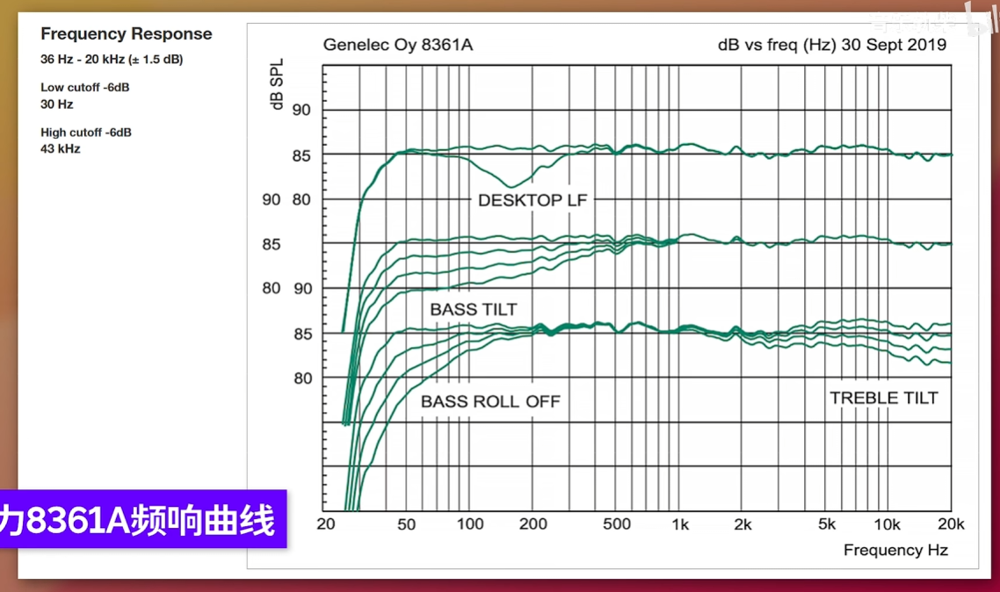
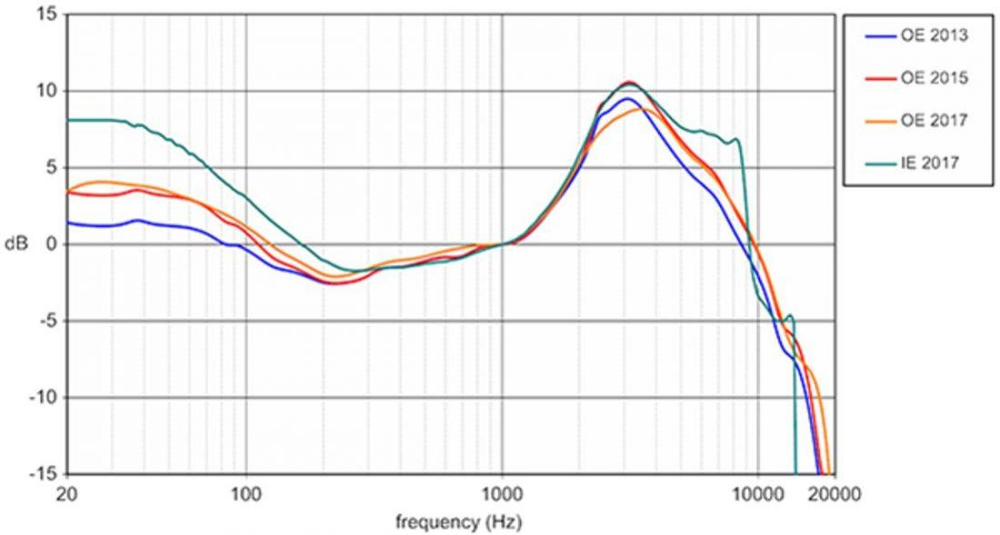
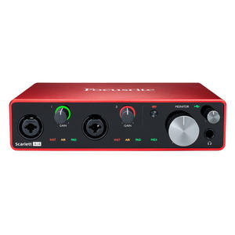
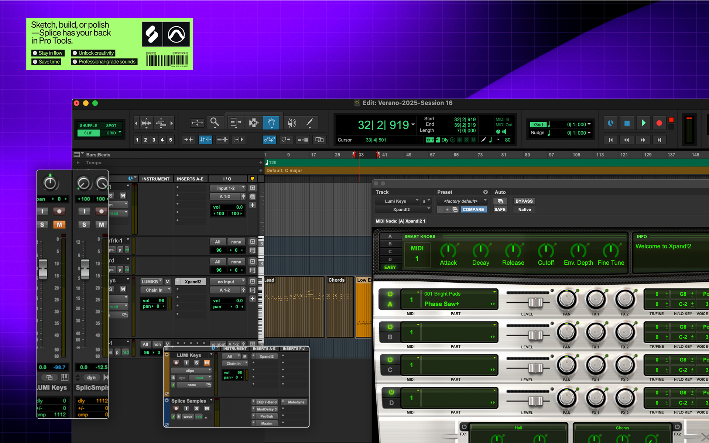
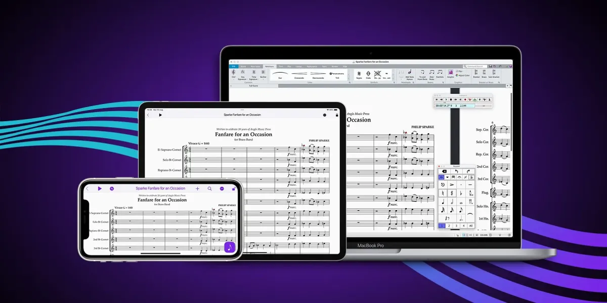
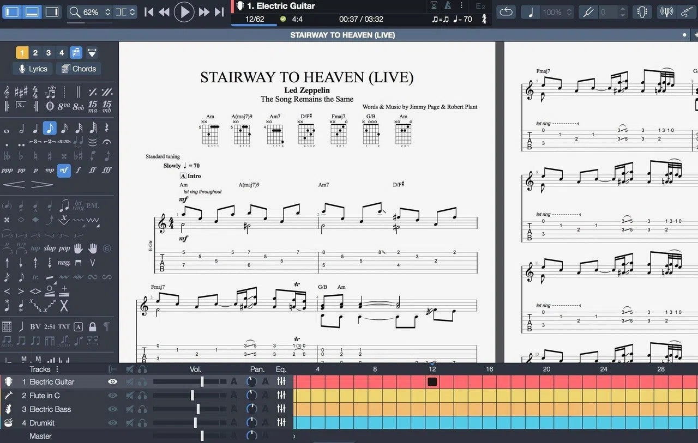
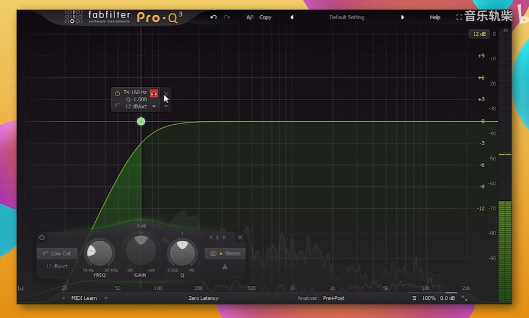
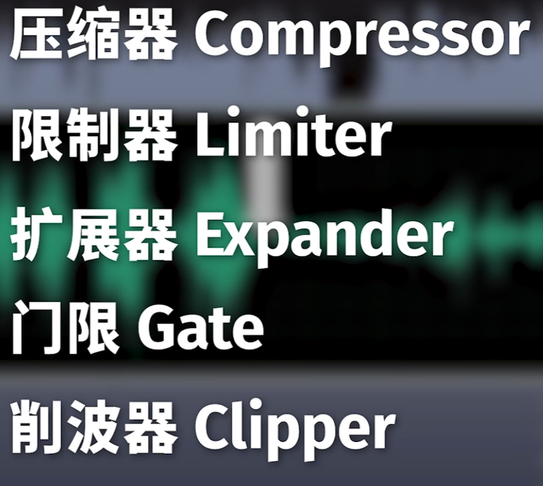
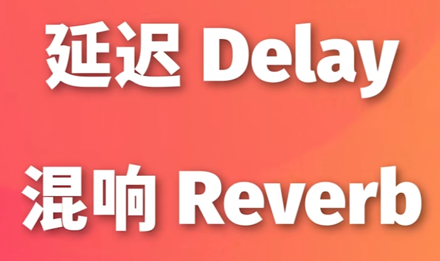

# 混音基础教程

## 硬件设备

- 电脑：mac，windows
- 监听音响 / 监听耳机（为了在绝大多数耳机上差不多效果，所以要**保持中立**）：频响曲线，衡量音频设备（如耳机、音响、麦克风）还原声音能力的图表
  - 监听音响：平直曲线
    
    
  - 监听耳机：哈曼曲线
  
    
  
- 专业声卡

  

## 软件

- DAW（音频工作站 / 宿主软件）

  

- 插件

  - 软件乐器
  - 软件效果器
  

- 打谱软件

  - 西贝柳斯（Sibelius）

    

  - guitar pro

    

    

### 效果器

[一个视频搞懂混音基础知识 专业术语 软件硬件 混响 压缩 均衡EQ 数字模拟 混音入门必看视频](https://www.bilibili.com/video/BV1bv4y1v7FH?p=4&vd_source=34e7d6e2081c3f2ce5f5123116b3beaf)

- 基础效果器

  - 均衡器EQ

    参数：频率，增益，Q值（越大越窄）

    频率分布：

    * **极低频 (20-60Hz)：** 力量感。底鼓(Kick)和贝斯(Bass)的专属区，其他乐器（如人声、吉他）一律用高通滤波器 **(HPF) 切除 80Hz 以下**
    * **浑浊区 (200-300Hz)：** “纸盒声/泥泞感”。很多乐器在这里叠加会导致混音糊掉，通常需要**做减法（衰减 1-3dB）**
    * **鼻音区 (500-800Hz)：** 军鼓的“敲击感”或人声的“鼻音”，视情况微调
    * **存在感与清晰度 (2kHz-5kHz)：** 人耳最敏感区域。人声的咬字在 3k-5k，吉他的扫弦也在这一带，**处理频率掩蔽（让吉他避让人声）**
    * **空气感 (10kHz以上)：** 用 High Shelf（高频搁架）提升 1-2dB，优化人声或镲片更通透
  
    
  
  - 动态处理器
  
    * **Threshold (阈值)：** 超过这个音量才开始压缩。通常设置在音频平均峰值向下 3-5dB 处
    * **Ratio (压缩比)：** 压平的力度
      * 柔和控制：2:1
      * 人声/吉他：3:1 到 4:1
      * 鼓组/平行压缩：8:1 甚至 20:1
    * **Attack (起始时间)：** 决定乐器的“打击感 (Punch)。
      * **慢起始 (10-30ms)：** 让声音的瞬态（如鼓槌打在鼓皮的瞬间）漏过去，鼓声会更有力。
      * **快起始 (0.1-2ms)：** 瞬间压住峰值，适合处理人声的爆音或用来做限制。
    * **Release (释放时间)：** 决定声音的“呼吸感”
      * **快释放 (50-100ms)：** 声音会迅速弹起，感觉更具攻击性和响度
      * **慢释放 (0.5s-2s)：** 适合平滑过渡，如抒情长音
  
    
  
  - 空间效果器：
  
    混响： 
    
    * **Pre-delay (预延迟)：** 设置 20ms-50ms 的预延迟，可以让干声先出来，混响随后才到，预延迟越长，大脑会觉得声源离墙壁越远
    * **Decay (衰减时间)：** 视BPM而定。快歌用短混响（0.8-1.2秒），慢歌用长混响（1.5-2.5秒）
    * **Room Size（空间大小）：**调大 Size，不仅混响时间可能会变长，反射声之间的间隙也会变大，听起来更空旷
    * **Mix / Dry-Wet（干湿比）：**0% 就是纯干声，100% 就是只有混响。如果是将混响挂在辅助通道（Send/Return），这个值必须设定为 100%；如果是直接挂在轨道上（Insert），通常调节在 10% - 30% 之间
    * **混响 EQ 技巧：** 在混响效果器的后面加一个EQ，**切除 600Hz 以下，切除 10kHz 以上**，只留中频混响。防止混音变糊
    
    延迟：
    
    - **Delay Time（延迟时间）：**通常 1/8~1/4 拍之间
    - **Feedback（反馈量）：**决定了回声会**重复多少次**，原理是将输出的延迟信号再次“喂”回输入端
    
    调节空间效果器时，最容易犯的错误就是“给得太多或者太少”。一个好的混响状态通常是：**当音乐播放时你几乎注意不到它的存在，但一旦把它关掉，你会立刻觉得声音干瘪、缺乏立体感**
    
    

## DAW 软件基础

- 驱动
- 路由

- 软件基础
- 录音

---

### 混音标准工作流 (Mixing Workflow)

1. **工程准备与整理 (Preparation & Session Setup)**
   * 轨道命名、按组上色（鼓组红色、贝斯紫色、人声黄色等）
   * **增益级设置 (Gain Staging)：** 保证所有轨道的平均电平在 **-18dBFS** 左右，峰值不超过 **-10dBFS**，给混音留出足够的动态余量 (Headroom)
2. **粗混与静态混音 (Static Mix)**
   * **仅使用音量推子和声像 (Pan)**，不加任何效果器，建立歌曲的基本骨架
     - 中间（C 位）：主唱 (Lead Vocal)，贝斯 (Bass)，底鼓 (Kick Drum)，军鼓 (Snare Drum)，Solo乐器
     - 极左与极右（包裹感）：节奏吉他 (Rhythm Guitars)，铺底合成器 (Synth Pads) / 弦乐 (Strings)，鼓组的吊镲
     - 半左半右区（左右对称平衡）：木吉他 / 钢琴 / 辅助键盘，踩镲 (Hi-hat)，嗵鼓 (Toms)
   * 确定音乐的焦点（通常是主唱或Solo乐器）
3. **修复性处理 (Corrective Processing)**
   * 剪辑、节奏对齐 (Time Alignment)
   * 减法EQ（切除底噪、消除共鸣频段）、门限 (Noise Gate)
4. **塑形与动态处理 (Tonal & Dynamic Processing)**
   * 压缩器控制动态、加法EQ提升色彩
5. **空间与深度营造 (Spatial Processing)**
   * 通过发送 (Send) 添加混响 (Reverb) 和延迟 (Delay)，构建三维声场
6. **自动化控制 (Automation)**
   * 画音量包络线 (Vocal Riding)，让情感起伏更自然；效果器参数随段落变化（如副歌混响变大）
7. **总线处理与导出 (Mix Bus & Export)**
   * 胶合压缩 (Glue Compression)、整体EQ微调、限制器 (Limiter) 达标

---

### 效果链 (Effect Chains)

#### 1. 人声效果链 (Vocal Chain)

0. **音高修正：**Melodyne，Auto Tune

1. **减法EQ (Surgical EQ)：** FabFilter Pro-Q3，HPF 100Hz，切除刺耳共鸣。
2. **去齿音 (De-Esser)：** 消除 "S"、"T" 等刺耳的高频（5k-8kHz）。
3. **压缩 **
5. **色彩处理：**加法EQ (Tonal EQ)，补偿10kHz 增加空气感等；利用电子管等效果器塑造色彩与饱和度 (Saturation)等
7. **发送效果 (Sends)：** 发送给独立轨道的 Delay (1/4或1/8音符) 和 Reverb (板式混响 Plate)

