## 第三部分：灯光系统与现场氛围 (Lighting)
*灯光主要用于烘托视觉情绪，本文简单基础学习一下灯光系统的处理逻辑，更多需要实际操作学习*

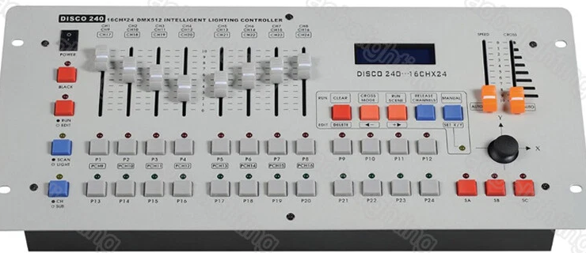

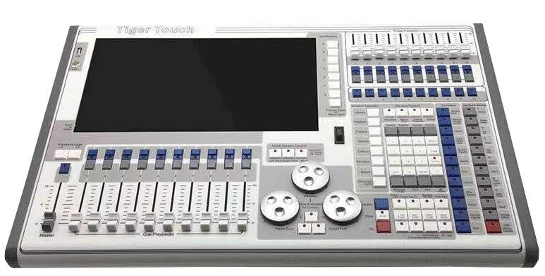

## 主要参数（通过推子或按钮改变参数）：

- **灯光亮度：**
  单位 K 开尔文（其实是一个温度单位，但是由于黑体辐射，就是物体温度较高时会发出光，比如说烧红的铁块），注意：灯光领域使用的是心理冷暖，即 蓝色：冷，黄色：暖
  
  - **暖白光 (Warm White) | 2700K - 3200K**
    - **视觉感受：** 偏黄，温馨，放松，慵懒。
    - **适用场景：** 卧室、高档餐厅、咖啡厅、需要营造浪漫或休息氛围的区域。
  - **自然白/中性光 (Neutral White) | 3500K - 4500K**
    - **视觉感受：** 柔和的白色，略带极少量的黄，最接近早晨或傍晚的自然光。
    - **适用场景：** 客厅、厨房、卫生间，兼顾了亮度和温馨感，是家庭常规照明的万金油。
  - **正白/冷白光 (Cool White / Daylight) | 5000K - 6500K**
    - **视觉感受：** 纯白甚至微弱发蓝，极其明亮、刺眼，能让人保持清醒。
    - **适用场景：** 办公室、教室、医院、图书馆、工厂。这种光线能抑制褪黑素分泌，提高工作效率，但绝对不适合用在卧室。
  
  
  常见操作：
  - **渐变 (Fade)：** 控制灯光亮起的缓慢程度，营造呼吸感或日出感。
  - **突亮 (Bump / Flash)：** 瞬间亮起，用于配合鼓点重音。
  - **黑场 (Blackout)：** 一键全暗，这是灯光最具视觉冲击力的操作之一，常用于歌曲结束或高潮前的极致反差。

- **灯光颜色：**

  以常见的 **RGB(Red Green Blue)** 为例，灯光会有三种颜色的灯泡，三者可以组合，比如说 Red + Green = Yellow，由此不断调整，从而符合需求(高端操作会使用 **CMY无极混色** 和 **色温控制 (CTO/CTB)** )。操作包含：**Snap（硬切，瞬间变色）** 和 **Fade（渐变混色，如从冷蓝慢慢过渡到紫红）**

  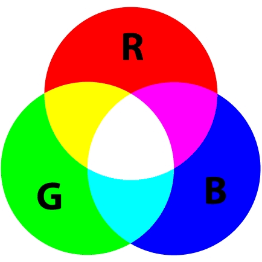
  
  *   **色彩心理学**
      *   **面光（Front Light）：** 照亮人物面部，色温要求干净（暖白/白光 3200K-5600K）。
      *   **顶光/逆光（Back Light）：** 打在人物肩膀和头发上，把人从背景中“抠”出来，增加立体感；也可做色彩渲染。
      *   **色彩搭配：** 慢歌用同色系（深蓝、紫、暖黄）；快歌用对比色（红+蓝，黄+绿）。
  
      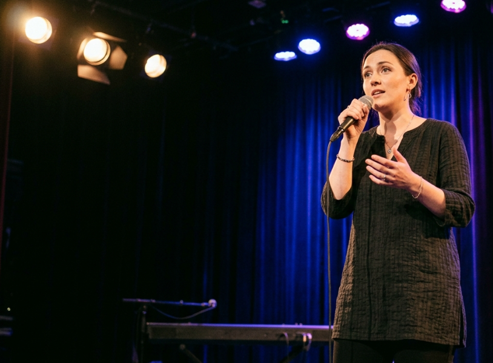

- **位置 (Position)：**

  控制灯具的 **Pan（水平，通常540度）** 和 **Tilt（垂直，通常270度）**。通过调整位置，可以做到“光束交叉”、“直打观众区”、“聚焦主唱”等效果。

- **光束与图案 (Beam & Gobo)：**
  - **图案 (Gobo)：** 打出星星、条纹、树叶等形状，配合旋转（Gobo Rotation）产生动感。
  - **棱镜 (Prism)：** 将一束光分成多束（如8棱镜），让舞台瞬间布满光束。
  - **雾化 (Frost)：** 将锐利的光束（Beam）瞬间变成柔和的面光（Wash），常用于慢歌渲染。
  - **调焦/放大 (Focus / Zoom)：** 改变光柱的粗细和边缘的锐利度。

  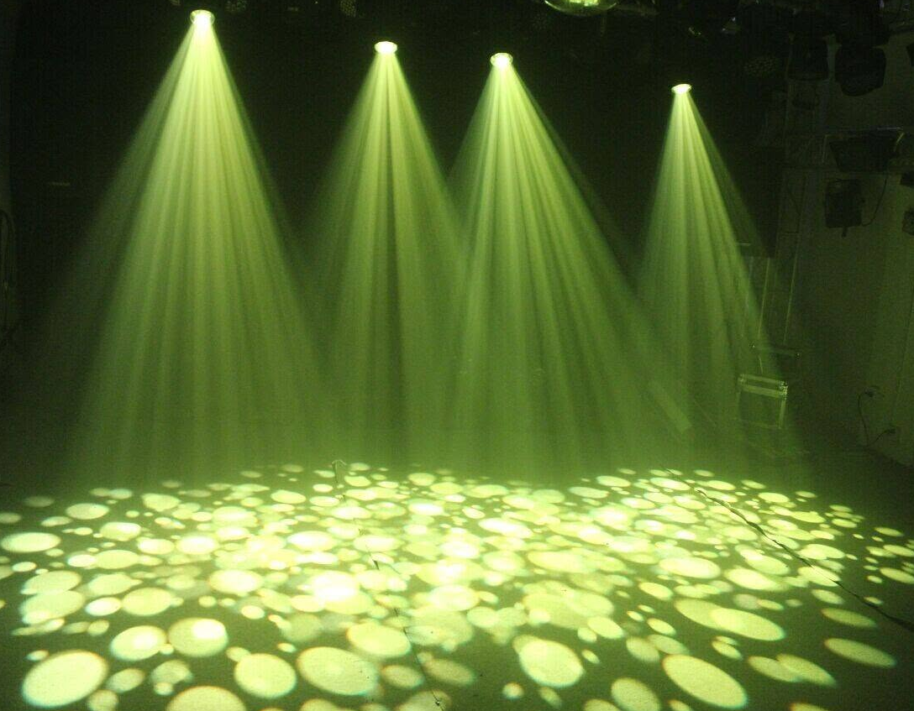

## 实际使用：

* **线材**

  *   **信号传输：**DMX 专用线（3/5 针，3 针的接口和 XLR 接口完全一致，阻抗在 **120 欧姆** 左右）。DMX 标准其实是 5 芯，防止混用，但是为了省钱和方便，国内厂家大量采用了 3 芯接口

  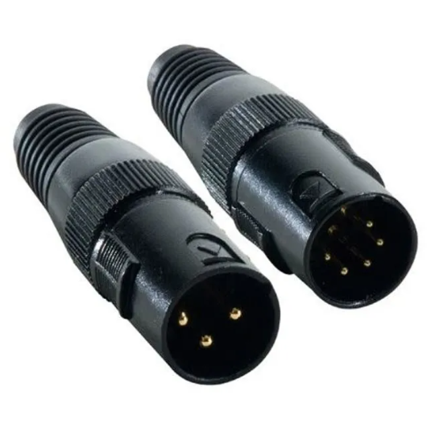

  * **供电：**电源航空插 PowerCON（专门用来传输 220V 交流电），**蓝色接头 (Power In)：** 代表电源**输入**，**灰色/白色接头 (Power Out)：** 代表电源**输出**

    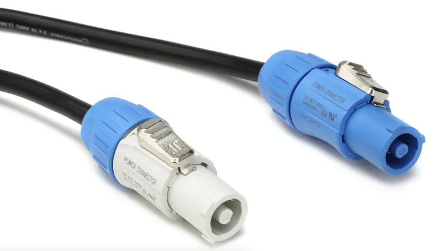
  - **终端电阻 120 欧姆电阻 Terminator：**终端电阻（Terminator）直接插在最后那一台 DMX OUT 接口，吸收多余能量，防止信号反弹（直接中断，这股能量无处释放，就会像撞到一堵硬墙一样，**原路反弹回去**，干扰输入信号），提高系统稳定性
  
    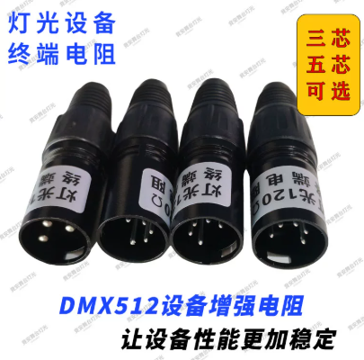

* **设备连接：信号与地址**

  * **连接方式 Daisy Chain（菊花链）：** 信号从控台出，进灯1，灯1出，进灯2... 以 DMX 专用线 串联到底，信号会不断转发。

  * **DMX 地址码：** 每个灯具按 16 个通道计算。1号灯拨码是1，2号灯拨码是17，3号灯是33... 需要调整拨码按钮

  * **通信原理：** 总线上发布控制信息和地址信息，然后灯具判断是否是自己的地址，并进行对应操作

    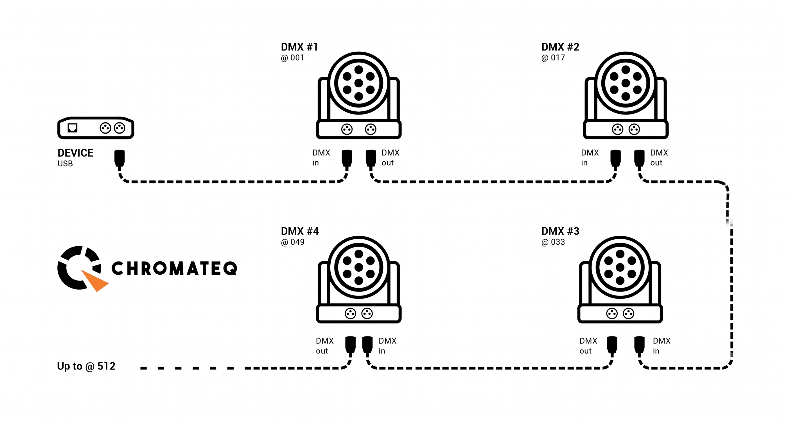

    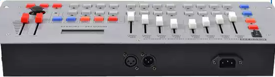

    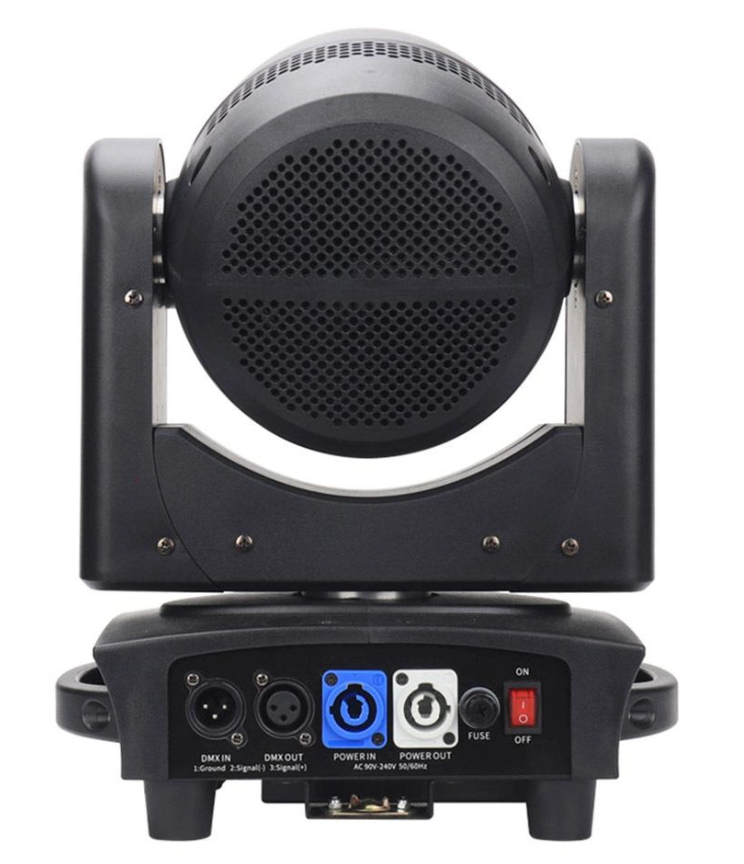
    
    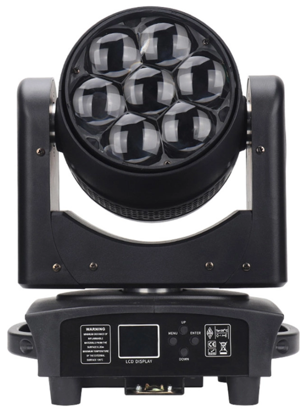

*   **控台实操步骤**
    *   **预热和冷却：** 注意灯光使用时开启和关闭都需要时间，以延长使用寿命
    *   **建场景（Scene）：** 配置好各个灯具的状态（尤其是对准人物位置，配置好颜色等），最后保存为 场景(Scene)，后续就可以是不同场景的切换
    *   **做走灯/程序（Chase）：** 将多个做好的 Scene 串联起来，调节 Speed（速度）和 Cross（渐变）推子，或者直接调用控台内置引擎（比如说画圆的动作）
    *   **快慢歌配合：** 慢歌要求 Cross 时间长，颜色过渡平滑；快歌结合重音，还有节奏卡点，手动点控频闪（Strobe）。

- **舞台烟雾**

  舞台灯光常常配合舞台烟雾使用，目的是呈现光束形状，增加视觉效果，营造氛围。下方是丁达尔效应可以看到光路径（上方介绍面光灯的图片中，则是只有物体表面会出现光）

  原理：丁达尔效应，即当一束光线透过胶体（或悬浮液）时，从垂直入射光的方向可以观察到胶体里出现一条明亮光路的现象

  制造舞台烟雾机器，最常见的有 薄雾机，浓烟机，低雾机等，内部多使用水雾（较轻，可营造云雾氛围）或者干冰（二氧化碳，较重，多处于底部）

  

  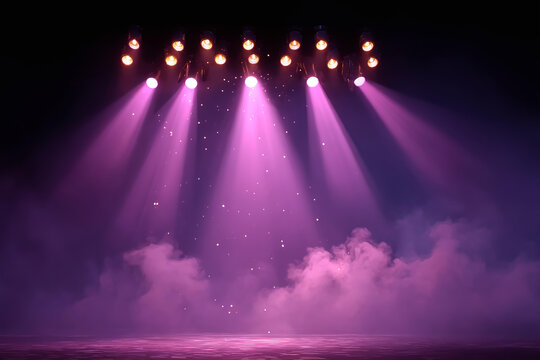
