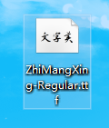
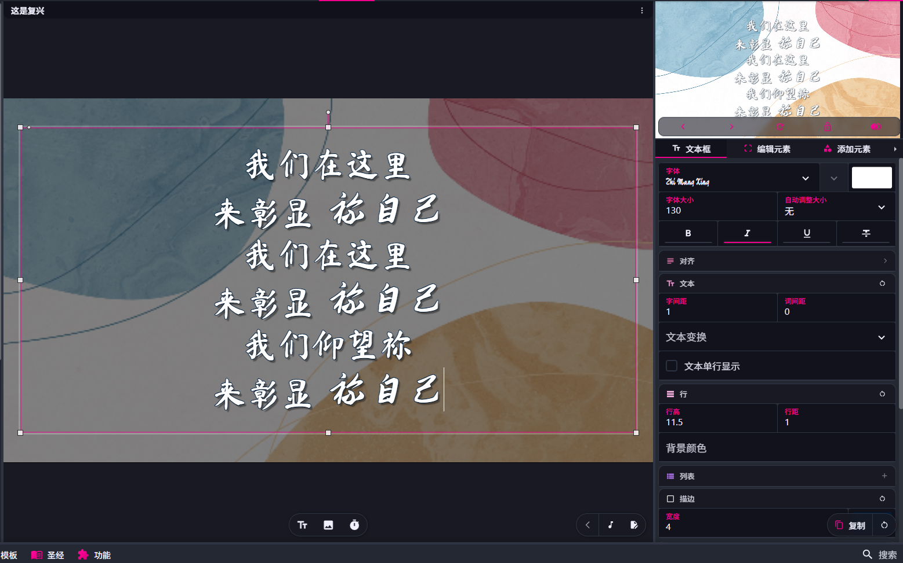
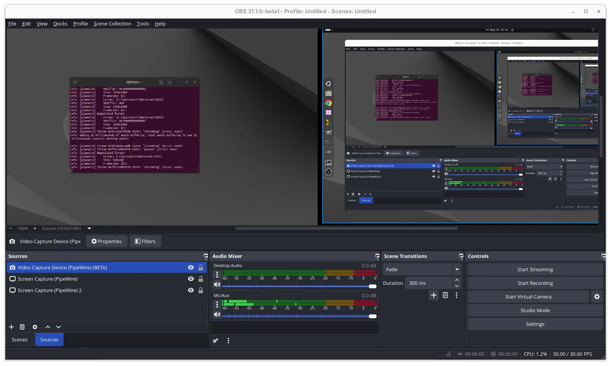
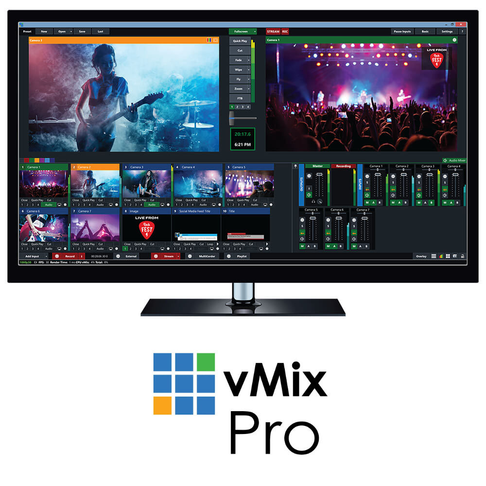

## 媒体与投影系统 (Media & Projection)

作为一种技能，而不是每次都必须要用

**PPT与专业投影软件对比**

- **PPT 的痛点：** 线性播放，跳转翻页困难；无法将控制界面与输出界面完全分离；修改背景需要每一页单独改
- **专业软件（如 FreeShow / ProPresenter）的核心：** **图层逻辑（Layers）**。讲解背景层、歌词层、音频层是完全独立的。换背景不影响歌词，清空歌词不影响背景

## 诗歌软件

诗歌本：歌谱全，有谱

赞美诗歌大全：投影快速，格式调整方便

## 圣经软件

精读圣经

投影圣经：多次经文快速切换

## Freeshow 投影软件

官网：<https://freeshow.app/>

一款免费开源的演示/投影软件（Presentation Software），主要用于教堂崇拜和现场活动。模仿 ProPresenter，底层操作逻辑一样，但是功能很全并且实用

个人经历分享：编写 Freeshow 教程，遇见 福建师范的一个朋友

### 背景

官方推荐资源库：<https://freeshow.app/resources>

**动态背景 (Motion Backgrounds / Video Loops)：** 无缝循环的视频动画（如粒子、光斑、缓慢流动的色彩、大自然风景），如果是比较热情的敬拜，背景可以震撼一点，如后面现场参考的那样

**静态背景 (Stills / Images)：** 高清的风景、抽象几何、十字架或极简风格的图片。适合讲员分享、公告或对阅读清晰度要求极高的环节

**纯色块与氛围层 (Abstract & Ambient)：** 颜色渐变或半透明的蒙版层，用于叠加在摄像头实时画面或复杂的图片上，确保前排文本清晰可见

**主题/讲道插图 (Mini-Movies / Sermon Illustrations)：** 带有特定主题（如节日、特定经文或主题演讲）的短视频，用于引入话题或转场

### 文字

- 字体：注意搭配，推荐字体下载网址：<https://fonts.google.com/specimen/Zhi+Mang+Xing，下载> ttf 文件后双击打开安装

- 大小
- 位置：可以偏上面一些
- 行数行间距
- 颜色：RGBA 概念，尤其注意可读性（对比度），然后是美观
  - 明暗对比：深色背景 + 浅色文本（最推荐），浅色背景 + 深色文本
  - 不要把高饱和度的互补色直接叠放在一起，比如说红绿，红蓝
  - 同色系搭配
  - 眯眼测试：眯起眼睛看屏幕。如果无法一眼分辨出文字的轮廓，说明对比度不够，需要调整
  - 现场实际效果测试，现场效果和电脑预览差异很大

  

### 现场参考

参考 show：

舞台显示器 (Stage Display / 提词器)：

内容包含：当前歌词、下一句歌词、当前时间、演讲倒计时（TimeOut）、给讲员的私密提示信息等

倒计时：

普通倒计时 & 距离特定时间倒计时

### 标准流程

- 屏幕与输出路由配置：Main Display (主屏幕) & Stage Display / Confidence Monitor (舞台返显)
- 全局模板与媒体库准备
- 舞台返显配置
- 构建节目单（基于当天的流程表）：暖场幻灯片，倒计时 ，歌词，讲道内容...
  - 暖场候场 (Pre-Service Loop)：屏幕自动循环播放欢迎语、近期活动预告、WiFi 密码、教会/活动二维码
  - 倒计时与开场 (Countdown & Opener)：屏幕出现 5 分钟动态倒计时，背景音乐音量可能逐渐推高，收拢全场注意力
  - 诗歌敬拜 (Worship Music)：动态视频背景 (Motion Graphics) 配合高清晰度、无衬线字体的歌词、间奏空白等
  - 欢迎与报告 (Welcome & Announcements)：家事汇报
  - 讲道 / 主题演讲 (Sermon & Message)：讲员标题页、核心经文展示（实时翻找经文）、要点提纲 (Bullet points)
  - 回应祷告与呼召 (Ministry / Response)：画面切换到舒缓、暗色调的动态背景，屏幕上出现最后一首回应诗歌的歌词
  - 散场 (Post-Service / Outro)：屏幕显示“感谢参与 / 下周见”，随后切回类似暖场环节的活动预告循环，播放散场音乐
- 实时播放投影并随机应变突发情况

### 注意事项

- **排版美学与规范：**
  - **字号与对比度：** 确保最后一排观众能看清。深色背景配浅色字加黑边/阴影
  - **整体风格：**背景，文本的风格匹配，歌词风格匹配
  - **歌词行数：** 每页最多 2-4 行
  - **提前量（Lead time）：** 提前翻页，并且极快反应错误，修正翻页
- **歌词来源：** 对接诗歌本，赞美诗歌大全，联网搜索，Youtube，手打
- **人性化 & 全程无感，自然**

## 其他投影软件

- ProPresenter

  

- 极演

## 相机

#TODO

## 导播

### 导播软件

目前音控室只是简单利用 OBS 投影到老年室

电脑导播：输入采集卡，输出显卡，处理 OBS / vMix

OBS:

vMix:

### 导播台

将各种输入的音视频素材，实时、精准、美观地编排后呈现

功能：

- 画面切换
- 预览与输出，辅助输出
- 内部视频矩阵
- 混合特效列
- 净信号输出
- 特效转场
- 多画面监看
- 叠加
- 音频处理
- 推流与节目录制
- 宏命令

