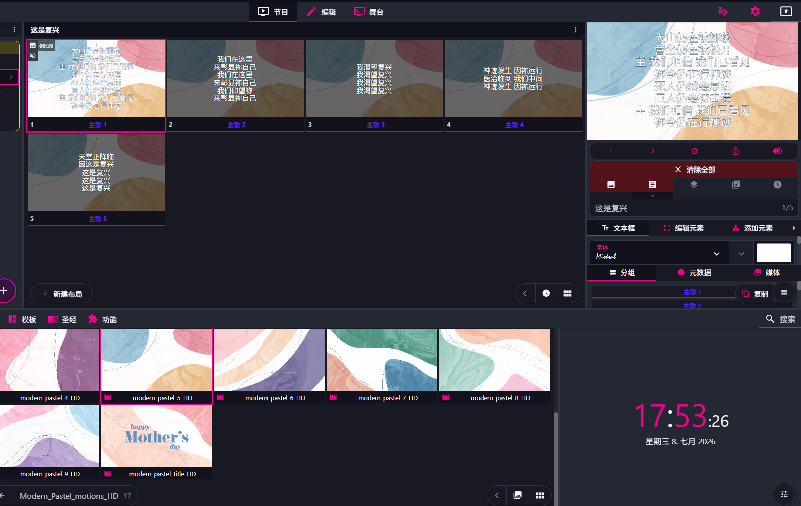
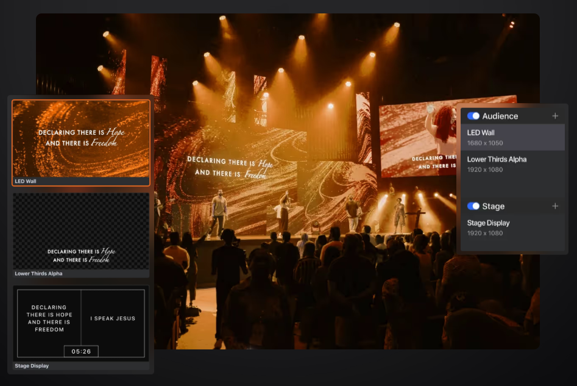
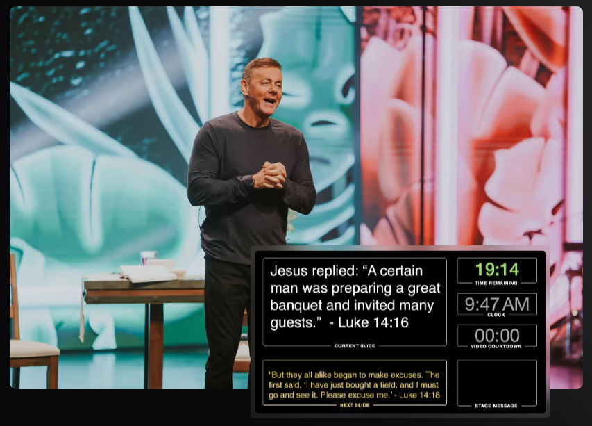
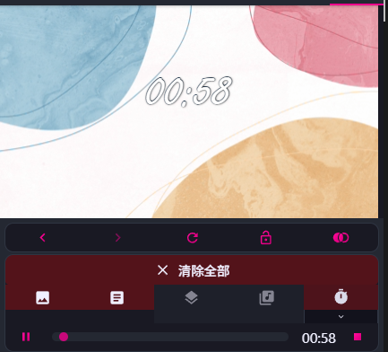
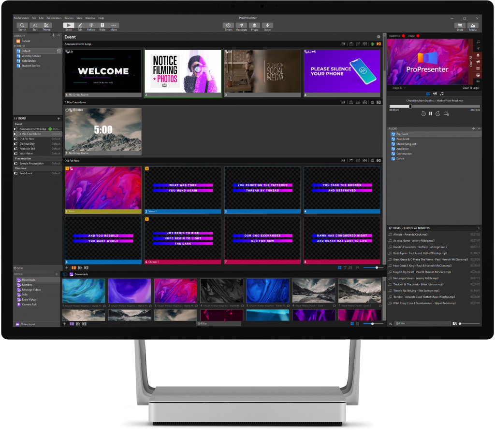
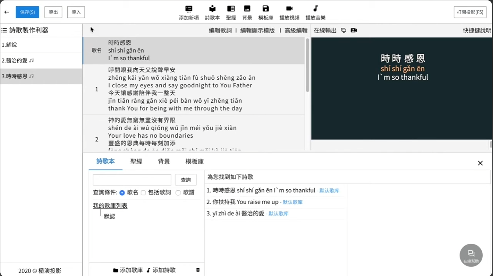
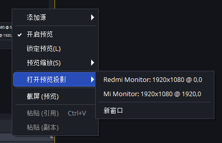
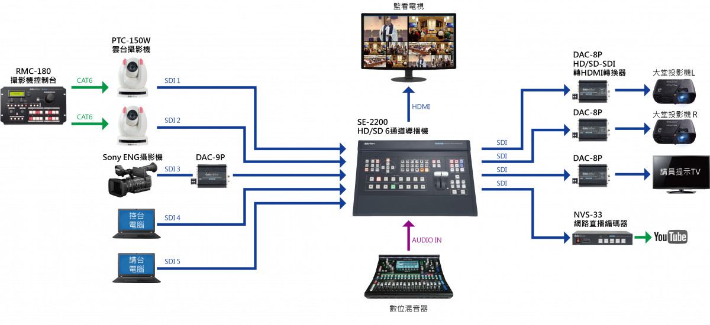
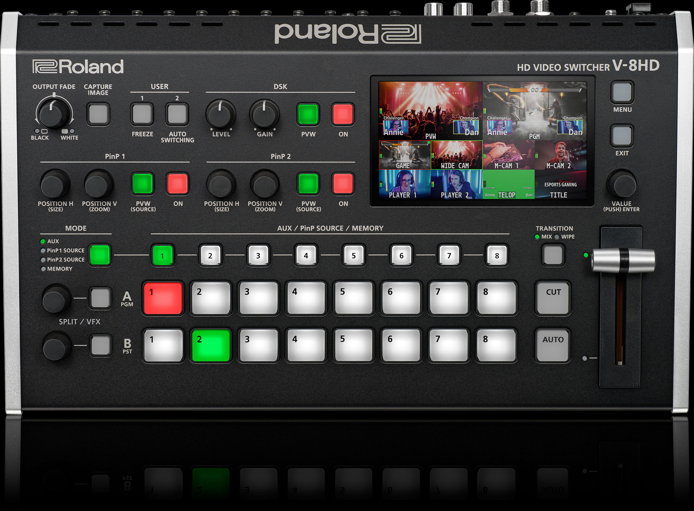
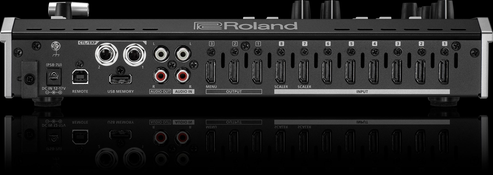

## 媒体与投影系统 (Media & Projection)

## 诗歌

## 圣经

## Freeshow 投影软件

一款免费开源的演示/投影软件（Presentation Software），主要用于教堂崇拜和现场活动。

**2.1 为什么淘汰 PPT？（认知升级）**

*   **PPT 的痛点：** 线性播放，主领一旦跳着唱，翻页极其困难；无法将控制界面与输出界面完全分离；修改背景需要每一页单独改。
*   **专业软件（如 FreeShow / ProPresenter）的核心：** **图层逻辑（Layers）**。讲解背景层、歌词层、前景道具层、音频层是完全独立的。换背景不影响歌词，清空歌词不影响背景。

个人经历分享：Freeshow 教程，遇见 福建师范的一个朋友

### 背景

官方推荐资源库：https://freeshow.app/resources

**动态背景 (Motion Backgrounds / Video Loops)：** 无缝循环的视频动画（如粒子、光斑、缓慢流动的色彩、大自然风景），常用于歌曲歌词背景，能增加舞台动感而不喧宾夺主。

**静态背景 (Stills / Images)：** 高清的风景、抽象几何、十字架或极简风格的图片。适合讲员分享、公告或对阅读清晰度要求极高的环节。

**倒计时视频 (Countdowns)：** 带有 5 分钟、3 分钟等倒计时的动态视频，用于活动开始前，提醒观众就座。

**主题/讲道插图 (Mini-Movies / Sermon Illustrations)：** 带有特定主题（如节日、特定经文或主题演讲）的短视频，用于引入话题或转场。

**纯色块与氛围层 (Abstract & Ambient)：** 颜色渐变或半透明的蒙版层，用于叠加在摄像头实时画面或复杂的图片上，确保前排文本清晰可见。

### 文字

- 字体
- 大小
- 位置
- 行数行间距
- 颜色

### 现场参考

参考 show：

提词器：

倒计时：

### 注意事项

*   **排版美学与规范：**
    *   **字号与对比度：** 确保最后一排观众能看清。深色背景配浅色字加黑边/阴影。
    *   **歌词行数：** 每页最多 2-3 行，千万不要把一整段密密麻麻堆在屏幕上。
    *   **提前量（Lead time）：** 重点培训负责翻页的人员——**必须在主领唱出下一句的“前 0.5 秒”切出下一页**，而不是等他唱了才按。
*   **数据库联动：** 演示如何对接《赞美诗歌大全》、精读圣经，实现 5 秒内现场快速搜歌、搜经文并上屏。

## 其他投影软件

- ProPresenter

  

  

- 极演

## 导播

### OBS

目前只是简单投影到老年室

### 导播台

将各种输入的音视频素材，实时、精准、美观地编排后呈现

功能：

- 画面切换
- 预览与输出，辅助输出
- 内部视频矩阵
- 混合特效列
- 净信号输出
- 特效转场
- 多画面监看
- 叠加
- 音频处理
- 推流与节目录制
- 宏命令

