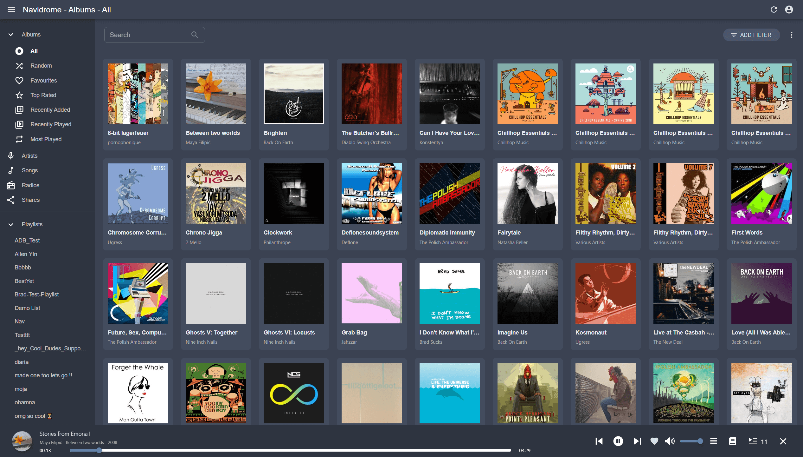
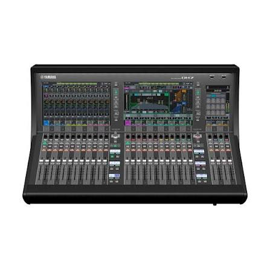
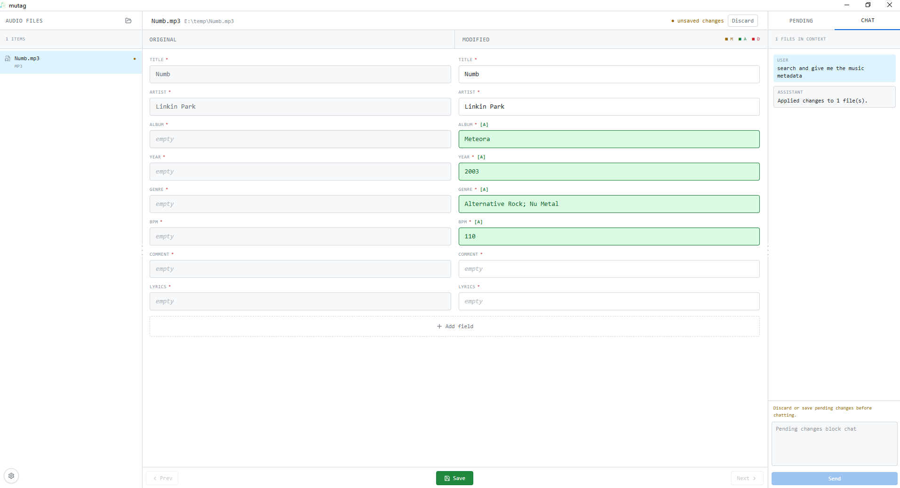
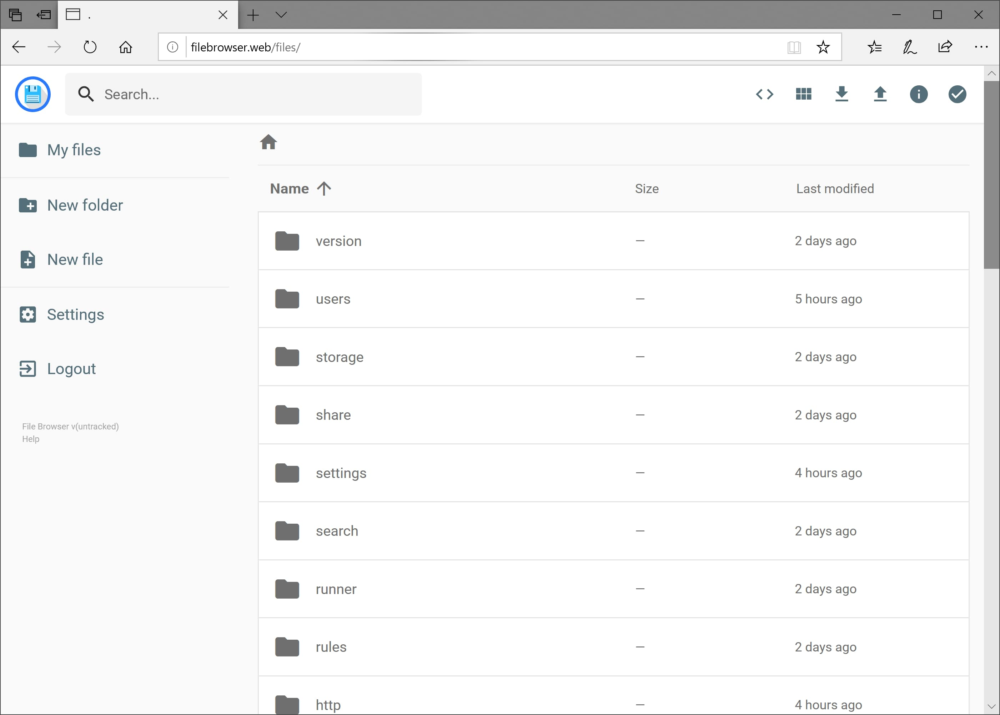

# 团队软件介绍

由于许多原因，有很多服务不得不私有化部署，下面是一些 团队软件

具体使用网址，账户密码，线下传递

打谱软件 guitar pro， musescore

声学测量软件

## 1. Navidrome & 音流 & 云服务器 & 音频元数据

### 1.1 Navidrome

Navidrome 是一款现代、开源且极度轻量级的自托管音乐服务器和流媒体平台。它可以让你将本地的音乐文件托管在自己的服务器上，并通过网络在任何设备上随时随地串流收听，相当于搭建了一个完全属于你个人的 Spotify 或 Apple Music。Navidrome 是作为服务端的存在，并且支持通过 web 提供服务

实践操作：添加歌曲，创建账户，配置权限

### 1.2 音流 StreamMusic

app 下载官网：https://music.aqzscn.cn/

一个音频软件 app，可以和 Navidrome 联动，就是 Navidrome 没有移动端 app，音流 补足了这一短板

实践操作：app 下载，账户登录

### 1.4 网络服务

云服务器介绍，VPS，内存，存储，网络线路，CDN，VPN 等基础知识

### 1.5 音频元数据 Audio Metadata

嵌入在音频文件内部的数据，用于描述该音频的各项属性，而不是声音本身。当你用播放器听歌时，屏幕上显示的歌曲名称、歌手、专辑封面等信息，都是直接从这些元数据中读取出来的。当然也有一下网站收集，但是有很多局限性

以个人开发的软件 mutag 为例：https://github.com/TecReaGroup/mutag

实践操作：了解音频文件各种基础 tag，lrc 歌词格式

### 1.6 常见音乐软件 & 敬拜乐队

常见音乐软件有：Apple Music，Shopify，Youtube Music 等，有许多音频或者翻唱他们可能只上传到 Youtube MV

敬拜乐队：分辨的心不可无，但是更重要的是敬拜的心和热情不可少。比较优秀的有：赞美之泉，约书亚乐团，泥土音乐等等，具体也可以看看音流里面收集了哪些团队的专辑。当然了解他们的历史，经历各方面还是很有趣，并且有造就的事情

## 2. FileBrowser

FileBrowser 是一款**开源、轻量级的自托管文件管理系统**，通常被用作个人私有云盘。它允许用户通过 Web 浏览器远程访问和管理服务器或本地计算机上的文件。

### 核心功能与特点

*   **可视化文件管理：** 提供直观的图形界面，支持在浏览器中进行文件的上传、下载、删除、重命名、移动、复制、创建文件夹等操作。
*   **在线预览：** 支持在线文本文件（如 `.md`, `.txt`, `.conf`）直接在浏览器中编辑；支持图片、视频和音频文件的直接预览或播放。
*   **多用户系统：** 允许创建多个用户账号，每个用户可以拥有独立的根目录和细致的权限设置（例如，只读访问、禁止删除等）。
*   **文件分享：** 可以生成公网或内网的文件分享链接，并可设置有效期和密码来保护分享内容。

### 适用场景

*   **个人/家庭私有云：** 极客用户常用它在家庭 NAS、旧电脑或云服务器上搭建属于自己的网盘。
*   **服务器文件管理：** IT 管理员或程序员使用它为非技术人员提供图形化的文件操作入口，或用于日常的快速文件预览和传输。
*   **团队协作：** 满足公司内部或小型团队的临时文件共享需求。

实践操作：添加文件，分享文件，创建账户，配置权限